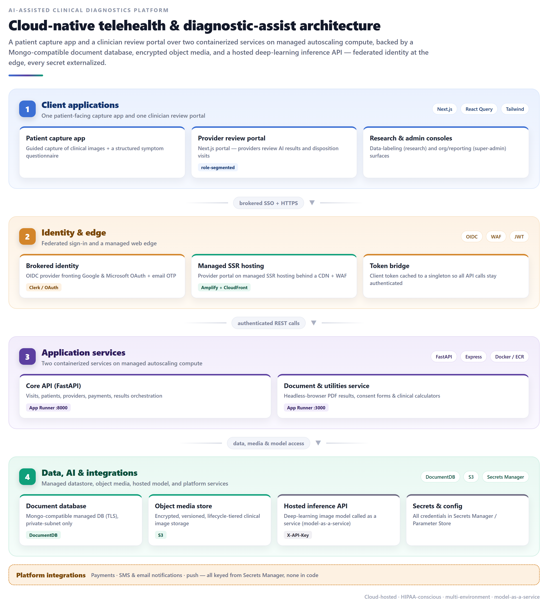
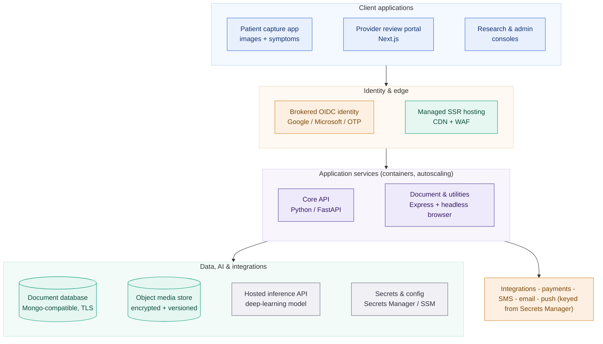
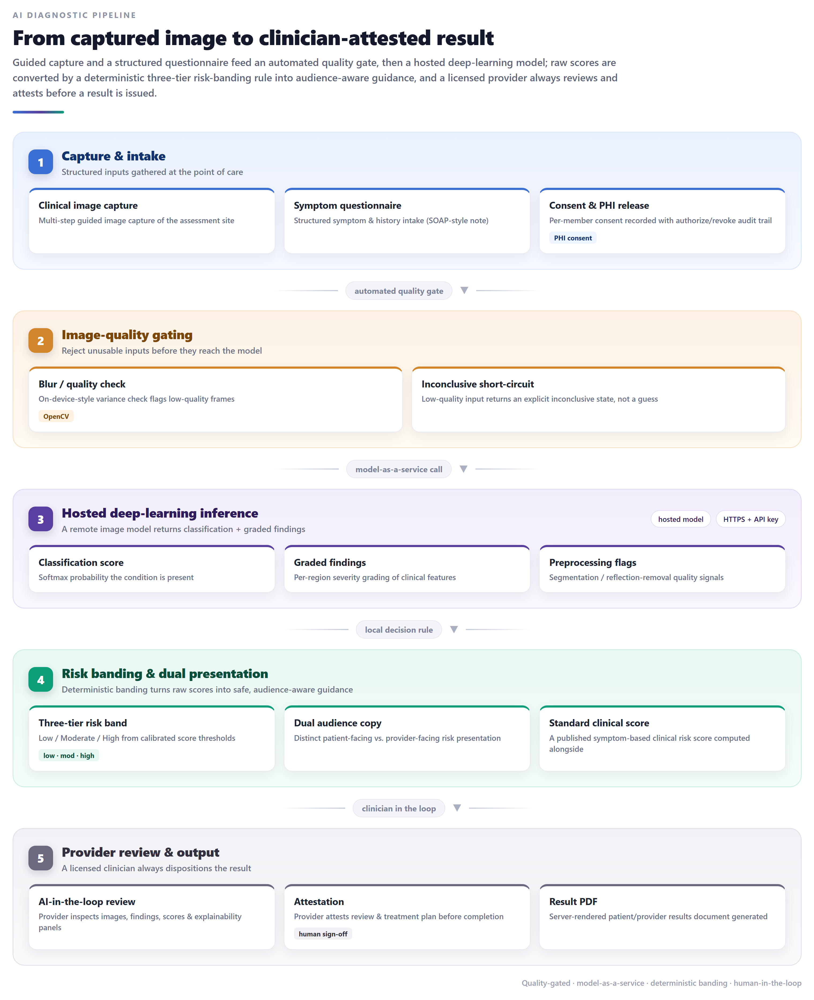
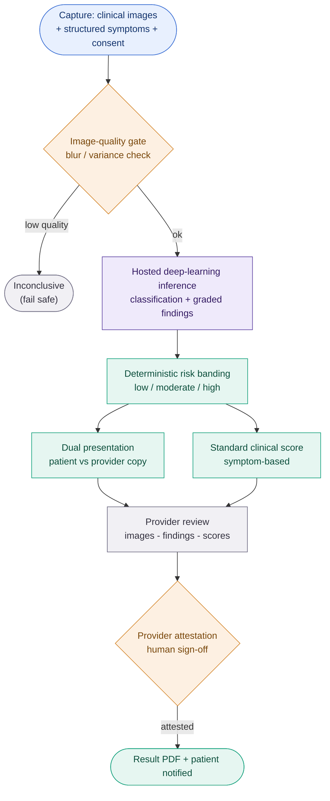
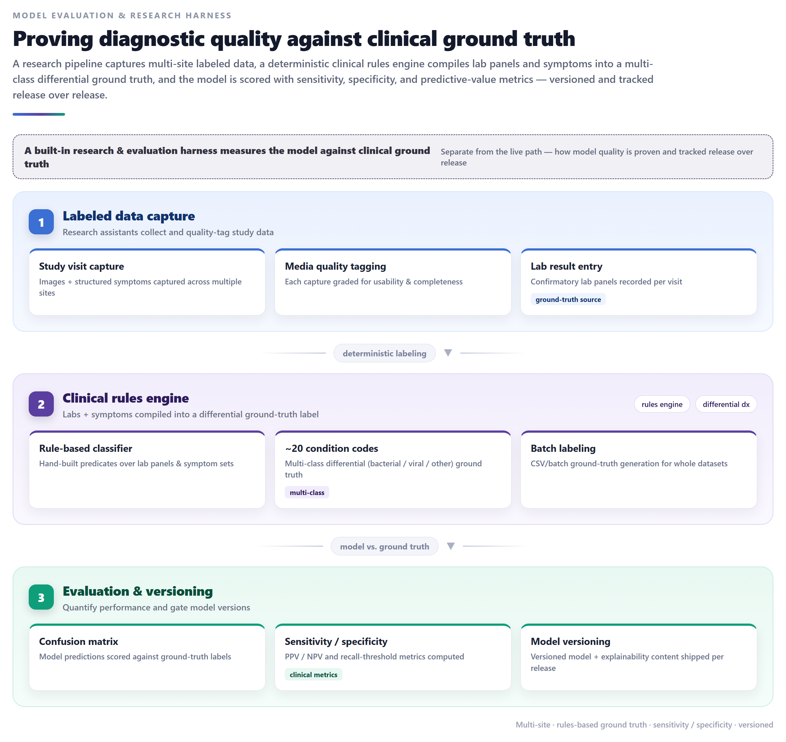
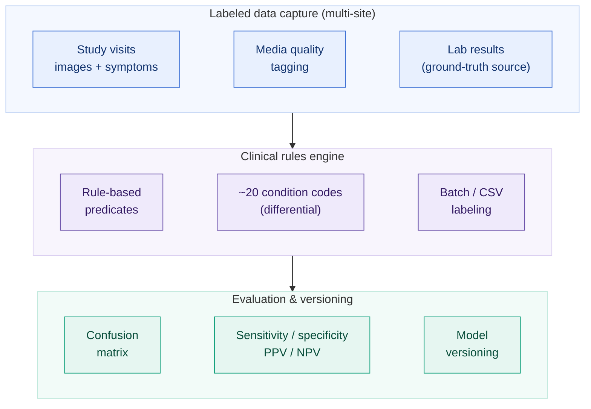
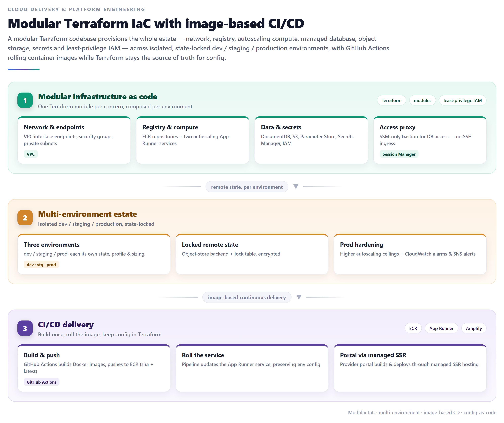
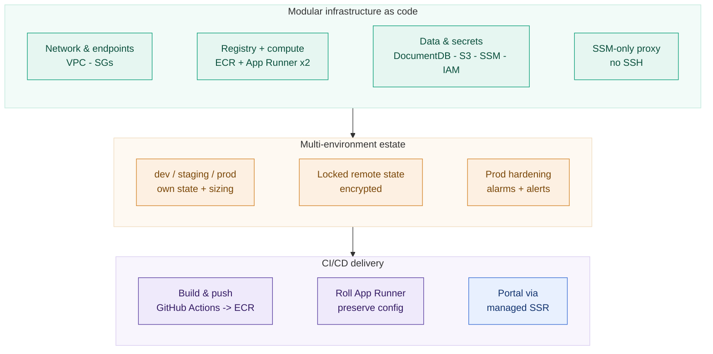

# AI-Assisted Clinical Diagnostics Platform

## ⚠️ Proprietary Work & Copyright Notice

This case study represents proprietary methodologies and NDA-compliant frameworks.

**This project is NOT open-source.**

© 2026 Rohail K. Malhi. All rights reserved.

You are welcome to read and review these materials to understand my professional capabilities. However, you are **strictly prohibited** from copying, adapting, or utilizing these artifacts, structures, or content in any form. See [LICENSE](LICENSE).

---

**A cloud-native digital-health platform that puts an AI image-analysis model in the hands of clinicians for point-of-care diagnostic screening. A patient app captures clinical images and a structured symptom questionnaire; a hosted deep-learning model returns a classification and graded findings; a deterministic risk-banding layer turns raw scores into safe, audience-aware guidance; and a licensed provider always reviews and attests before a result is issued. Around that core: payments, notifications, consent/PHI management, server-rendered result documents, and a research harness that proves the model against clinical ground truth — all on modular AWS infrastructure-as-code.**

> **Confidentiality note.** This is a sanitized portfolio overview. The client identity, product names, the specific clinical condition, partner and study-site names, brand assets, internal hostnames, and cloud account identifiers are withheld under NDA. Everything here describes engineering and AI/ML capabilities at a level safe for public sharing. The platform is intentionally condition-agnostic in this write-up; industry standards referenced (OIDC, FHIR-style consent, HIPAA practices) are public and reveal no client data. Model thresholds shown are illustrative and reveal nothing proprietary; confidential values are omitted.

---

## Challenge

A digital-health company set out to deliver **AI-assisted diagnostic screening for a common acute condition** — the kind of assessment normally requiring an in-person clinic visit — through a combination of at-home capture and clinician review. Turning a research model into a safe, sellable, regulated product raised several hard problems at once:

- **A model is not a product.** A deep-learning classifier that scores an image is a long way from a system a clinician can trust and act on. Raw model outputs had to become **calibrated, explainable, audience-appropriate guidance** — never a bare probability handed to a worried patient.
- **Patient safety and human oversight are non-negotiable.** For a regulated clinical use case, the AI can *assist* but a **licensed provider must review and attest** to every result. Unusable inputs must fail safe (explicitly "inconclusive"), not produce a confident guess.
- **It handles PHI end-to-end.** Clinical images, symptoms, and identities are protected health information. Consent had to be explicit and revocable, storage encrypted, access authenticated and role-scoped, and actions auditable.
- **It had to prove itself.** A clinical AI product must demonstrate **sensitivity, specificity, and predictive value** against real ground truth — which means a whole second system for labeled data collection and model evaluation, separate from the live path.
- **It had to be operable and evolvable.** Multiple environments, multiple client/partner sites, payment and notification integrations, and a model that would be **re-versioned repeatedly** — all needing repeatable, governed cloud delivery rather than hand-built infrastructure.

They needed a platform where the model was just one component inside a **safe, observable, compliant, and continuously-improvable clinical workflow**.

---

## Solution

A four-service platform on AWS, engineered so that AI assists but never decides alone, and so that model quality is measured, not assumed.

### The AI diagnostic pipeline — safe by construction
- **Guided capture + structured intake.** A patient app walks the user through multi-step **clinical image capture** and a **structured symptom questionnaire** (assembled into a clean, SOAP-style clinical note), with explicit, revocable **consent** recorded per member.
- **An automated quality gate.** Before any inference, an image-quality check (a computer-vision blur/variance measure) rejects unusable frames; low-quality input **short-circuits to an explicit "inconclusive" state** rather than risking a bad prediction.
- **Model-as-a-service inference.** The image is sent to a **hosted deep-learning model** that returns a classification score (probability the condition is present) plus **per-region graded findings** and preprocessing-quality signals — so inference scales independently of the application and can be re-versioned without redeploying the app.
- **Deterministic risk banding.** Raw softmax scores are converted locally by a **calibrated three-tier rule (low / moderate / high)** into human-readable guidance — with **distinct patient-facing and provider-facing presentations** of the same result, so a clinician sees nuance a patient shouldn't be handed raw.
- **A standard clinical score alongside.** A published, symptom-based clinical risk score is computed from the intake data and presented next to the model output, giving clinicians a familiar second signal.
- **Human in the loop, always.** A licensed provider reviews the images, findings, scores, and explainability panels, then **attests** to their review and treatment plan before the visit is completed and the patient notified.

### A clinician review portal
- **Role-segmented by design.** A Next.js portal serves three audiences behind one federated sign-in: **providers** (review and disposition visits), **super-admins** (manage providers, run reporting dashboards), and **research assistants** (data capture and labeling) — each routed to its own workspace by role.
- **AI-in-the-loop review workflow.** Providers work a clear visit lifecycle (new → in review → completed), inspect the AI result and image analysis, and generate a **server-rendered PDF results document**; a provider **attestation** gates completion.
- **White-label theming.** Branding and site-specific pathways switch automatically based on the authenticated user's organization membership — one codebase, many partners.

### Proving the model — a research & evaluation harness
- **Labeled data at multiple sites.** Research assistants capture study visits (images + structured symptoms + confirmatory lab results), grading each capture for media quality.
- **A clinical rules engine for ground truth.** A hand-built, deterministic rules engine compiles lab panels and symptom sets into a **multi-class differential ground-truth label (~20 condition codes)** — bacterial vs. viral vs. other — including a batch/CSV path for whole datasets.
- **Real clinical metrics.** Model predictions are scored against that ground truth via a **confusion matrix**, yielding **sensitivity, specificity, PPV/NPV** and recall-threshold metrics — tracked as the model is **re-versioned**, with versioned explainability content shipped per release.

### Delivered as modular infrastructure-as-code
- **One Terraform module per concern.** Network/VPC endpoints, container registry, autoscaling compute, managed database, object storage, parameter store, secrets, and least-privilege IAM are each a reusable module, composed per environment.
- **Isolated, state-locked environments.** Separate dev / staging / production, each with its own encrypted remote state and lock, its own sizing, and production-only hardening (higher autoscaling ceilings, CloudWatch alarms → SNS alerts).
- **Image-based CI/CD.** GitHub Actions builds a container image, pushes to the registry, and rolls the managed service — while **Terraform stays the single source of truth for runtime configuration**, so deploys swap code, not config.

---

## Architecture

A patient capture app and a clinician review portal sit behind a federated identity broker and a managed web edge. Two containerized services on managed autoscaling compute — a Python/FastAPI core API and a document/utilities service — are backed by a Mongo-compatible managed database, encrypted object storage, and a hosted deep-learning inference API, with every secret externalized to a managed secret store.

Diagram source (Mermaid)

### The AI diagnostic pipeline

Guided capture and a structured questionnaire feed an automated quality gate, then a hosted deep-learning model; raw scores become audience-aware guidance through a deterministic risk-banding rule, and a licensed provider always reviews and attests before a result is issued.

Diagram source (Mermaid)

**Why banding, not a raw score.** A deep-learning probability is precise but not *safe* on its own — the same 0.6 means very different things to a patient and a clinician. A deterministic, calibrated three-tier band (with an explicit inconclusive state) plus separate patient- and provider-facing copy turns the model's output into guidance a clinician can act on and a patient can understand, while the human attestation step keeps a licensed provider accountable for every result.

### Model evaluation & research harness

Separate from the live path, a research pipeline proves the model against clinical ground truth — the evidence base a regulated clinical AI product needs.

Diagram source (Mermaid)

### Cloud delivery & platform engineering

A modular Terraform codebase provisions the whole estate across isolated, state-locked environments, with image-based CI/CD rolling containers while Terraform owns configuration.

Diagram source (Mermaid)

### Technology

| Layer | Stack |
|---|---|
| **AI / ML** | Model-as-a-service deep-learning image inference (classification + per-region grading) · deterministic three-tier risk-banding · OpenCV image-quality gating · computed standard clinical risk score |
| **Model evaluation** | Deterministic clinical rules engine → multi-class differential ground truth (~20 codes) · confusion matrix · sensitivity / specificity / PPV / NPV · model versioning + versioned explainability content |
| **Core API** | Python 3.11 · FastAPI · Pydantic v2 · `pymongo` + `motor` (async) over a Mongo-compatible document database (TLS) · Uvicorn (multi-worker) · Docker |
| **Document / utilities service** | Node.js · Express · TypeScript · headless-browser (Puppeteer) HTML→PDF · EJS templates · server-rendered result documents, consent forms & clinical calculators |
| **Provider portal** | Next.js 14 (App Router) · React 18 · TanStack React Query · axios · Tailwind CSS · Recharts dashboards · white-label theming · role-segmented routing |
| **Identity & auth** | Brokered OIDC (Clerk) fronting Google / Microsoft (Azure AD) OAuth + email OTP · JWKS-verified JWTs · role-based access (provider / super-admin / research) · token-bridge singleton for non-React callers |
| **Data & storage** | Amazon DocumentDB (Mongo-compatible, encrypted, private subnets) · Amazon S3 (encrypted, versioned, lifecycle-tiered media) · Parameter Store · Secrets Manager |
| **Payments & messaging** | Stripe (payment sheets, webhooks, refunds) · Twilio SMS · SendGrid email · push notifications — all keyed from Secrets Manager |
| **Compliance & PHI** | Explicit, revocable per-member consent with audit trail · role-scoped access · structured CloudWatch audit logging · PHI kept in private, encrypted stores |
| **Infrastructure** | Terraform (modular: VPC endpoints, ECR, App Runner ×2, DocumentDB, S3, SSM, Secrets Manager, IAM, SSM-only proxy, managed SSR hosting, CloudWatch) · S3 + lock-table remote state · dev/staging/prod |
| **CI/CD** | GitHub Actions → Docker build → ECR (sha + latest) → App Runner image roll · Terraform as source of truth for runtime config · managed SSR pipeline for the portal |

---

## Engineering highlights

- **A model turned into a safe clinical product.** The deep-learning score is wrapped in an image-quality gate (fail-safe "inconclusive"), a deterministic calibrated risk-banding rule, dual patient/provider presentation, a familiar standard clinical score, and a mandatory provider attestation — the model assists, a licensed human always decides.
- **Model-as-a-service.** Inference is a hosted HTTP model behind an API key, decoupled from the app — so the model can be re-versioned and scaled independently, and the application ships risk logic, not weights. (The codebase records a clean migration from in-process PyTorch/ResNet + YOLO inference to this hosted approach.)
- **Evidence, not assumptions.** A dedicated research harness — multi-site labeled capture, a deterministic clinical rules engine producing multi-class differential ground truth, and confusion-matrix sensitivity/specificity/PPV/NPV — measures model performance and tracks it across versions.
- **PHI-aware from the ground up.** Explicit, revocable per-member consent with an audit trail, role-scoped authentication, encrypted private datastores, and structured audit logging.
- **One portal, three roles, many brands.** A single Next.js App-Router codebase serves providers, super-admins, and research assistants behind one federated SSO, with white-label theming driven by the user's organization — and a pragmatic token-bridge so non-React code stays authenticated.
- **Two-cloud migration, cleanly executed.** The platform history shows a deliberate consolidation onto AWS (App Runner, DocumentDB, S3, Secrets Manager) with brokered Clerk identity — superseding earlier Azure ML / Azure AD B2C / Azure Web App footprints — a real "legacy-to-cloud, in-process-model-to-model-as-a-service" story.
- **Infrastructure as modular code.** Every concern is a reusable Terraform module composed per environment, with isolated state-locked dev/staging/prod, least-privilege IAM, an SSH-less SSM-only database proxy, and production-only alerting.
- **Config-as-code delivery.** CI rolls container images while Terraform remains the single source of truth for runtime configuration — deploys change code, not environment.

---

## At a glance

A cloud-native, HIPAA-conscious **AI-assisted clinical diagnostics platform** that delivers point-of-care diagnostic screening for an acute condition. A patient app captures clinical images and a structured symptom questionnaire; an **image-quality gate** rejects unusable input (fail-safe inconclusive); a **hosted deep-learning model** returns a classification and graded findings; a **deterministic three-tier risk-banding** layer produces separate patient- and provider-facing guidance alongside a standard clinical score; and a **licensed provider reviews and attests** before any result is issued. A **research harness** proves the model against clinical ground truth — a deterministic rules engine builds a multi-class differential label, and sensitivity/specificity/PPV/NPV are tracked across model versions. Built as four services on AWS — a **FastAPI** core API and an **Express/Puppeteer** document service on App Runner, a role-segmented **Next.js** provider portal on managed SSR hosting, and **DocumentDB + S3 + Secrets Manager** for data and configuration — with **Clerk**-brokered SSO, Stripe/Twilio/SendGrid integrations, and **modular Terraform** infrastructure-as-code delivering isolated dev/staging/prod environments through image-based CI/CD.

---

> *Notice: This case study has been modified to comply with confidentiality agreements. The resulting framework and artifacts remain the strict intellectual property of Rohail K. Malhi and may not be duplicated or repurposed.*
