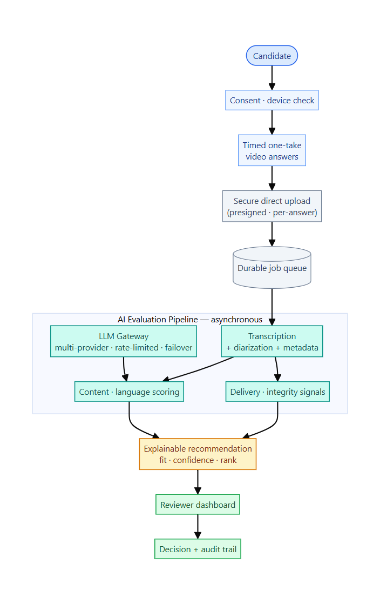
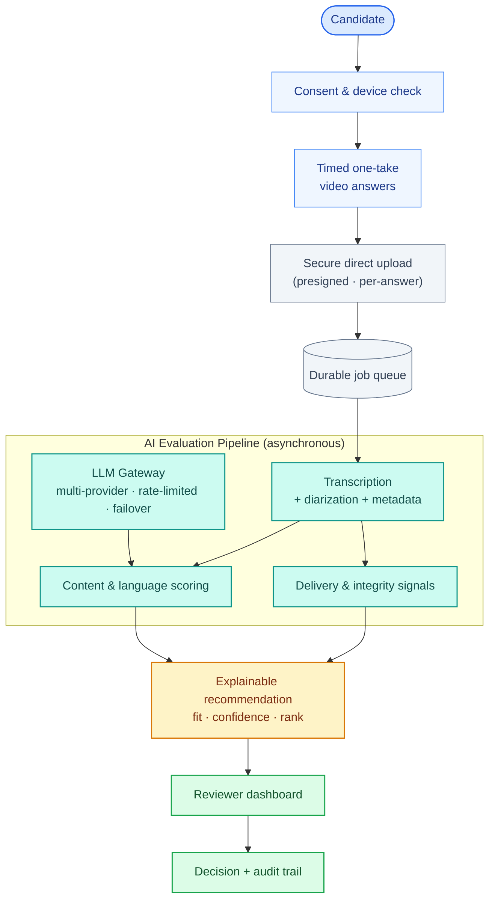
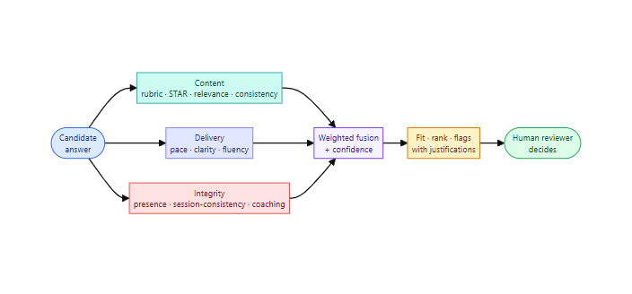
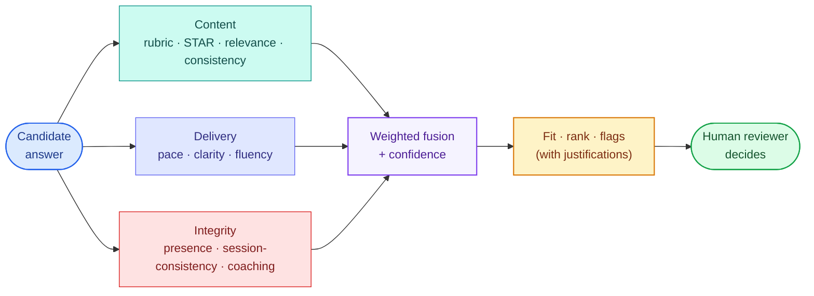

# AI-Assisted Video Pre-Screening Platform

## ⚠️ Proprietary Work & Copyright Notice

This case study represents proprietary methodologies and NDA-compliant frameworks.

**This project is NOT open-source.**

© 2026 Rohail K. Malhi. All rights reserved.

You are welcome to read and review these materials to understand my professional capabilities. However, you are **strictly prohibited** from copying, adapting, or utilizing these artifacts, structures, or content in any form. See [LICENSE](LICENSE).

---

**An asynchronous video-interview platform that turns first-round screening from a scheduling-heavy, subjective bottleneck into a fast, consistent, and fully explainable shortlisting engine — with a human always making the final call.**

> **Confidentiality note.** This is a sanitized portfolio overview. The client identity, product name, proprietary rubrics, and internal source are withheld under NDA. Everything here describes capabilities and engineering approach at a level safe for public sharing. Outcome figures are representative and anonymized.

---

## Challenge

Talent teams drown in the first round. For a single open role, a recruiter may need to screen dozens — sometimes hundreds — of applicants through 20–30 minute phone calls, most of which end in a "no." The cost isn't just time:

- **Scheduling friction.** Coordinating live calls across time zones and calendars stalls the funnel for days per candidate.
- **Inconsistent evaluation.** Different interviewers, different days, different questions — early candidates and late candidates are effectively judged on different scales.
- **Subjectivity and bias risk.** Unstructured "gut feel" screening is hard to defend and exposes the organization to fairness and compliance concerns in hiring.
- **No audit trail.** When a hiring decision is questioned, there's rarely a record of *why* a candidate advanced or didn't.
- **Throughput ceiling.** Screening capacity is capped by how many live calls a recruiter can physically run.

The client needed to screen **more candidates, faster, and more fairly** — without hiring an army of recruiters, and without replacing human judgment with a black box.

---

## Solution

We designed and built an **asynchronous, AI-assisted video pre-screening platform**. Candidates answer a structured set of interview questions on their own time via short, single-take video responses. The platform transcribes and analyses each answer across multiple dimensions, then produces an **explainable recommendation** — a score, a confidence level, and a ranking — that a human reviewer uses to decide who advances.

The guiding principle throughout: **AI assists, a human decides.** Every signal the system produces is transparent, traceable, and advisory.

### The candidate experience
- **One-click, no-account access.** Each candidate receives a unique, secure, expiring invite link — no sign-up friction.
- **Informed consent first.** An explicit, timestamped consent step precedes any recording, covering video, audio, and automated analysis.
- **Structured, timed answers.** Candidates read each question, get a moment to think, then record a single take within a fixed time limit that auto-submits — capturing authentic, comparable responses rather than over-rehearsed ones.
- **Works anywhere.** Desktop and mobile browsers, with a guided camera/microphone check and a low-pressure practice question before the real ones begin.
- **Resilient uploads.** Each answer uploads independently and securely, so a hiccup on one question never costs a candidate their whole interview.

### The evaluation engine
Every answer is assessed across three complementary dimensions, each kept in its proper role — *scored*, *advisory*, or an integrity *flag* — so nothing inappropriate ever silently drives a decision:

- **Content & substance (scored).** Answers are graded against a role-specific rubric with structured, criterion-by-criterion reasoning; behavioral answers are checked for a complete Situation-Task-Action-Result structure; responses are semantically compared to an ideal answer; and the system surfaces cross-answer contradictions, resume mismatches, likely AI-generated responses, and any red-flag statements — each for human review.
- **Communication & delivery (advisory).** Objective, transparent measures of speaking pace, pauses, fluency, and language — shown to reviewers as context, never folded into the score.
- **Integrity (flags for human review).** Session-consistency and presence checks, detection of off-camera prompting, and other authenticity signals — surfaced as flags for a person to weigh, never as an automated verdict.

Everything rolls up into a **recruiter-ready summary per candidate**: an overall fit score, a confidence value that tells reviewers where to focus their attention, a ranked shortlist, per-question highlights with justifications, and every integrity flag — all backed by the underlying transcript and video.

### The reviewer experience
- A **ranked candidate dashboard** per role, sorted by fit and confidence.
- A **per-candidate deep-dive**: video playback, full transcript, delivery metrics, integrity flags, and rubric scores *with their justifications* side by side.
- **Human override, always.** Reviewers can adjust any score or ranking and record their decision (advance / hold / reject) with notes — and every override is captured in an audit trail.

---

## Architecture

A cleanly decoupled, API-first system engineered so that heavy AI work never blocks candidates, and so the AI layer can flex across providers without touching the product.

Diagram source (Mermaid)

**Decoupled by design.** A standalone single-page web app serves three audiences — candidates, recruiters, and reviewers — against a focused API. The candidate's recording and upload path depends only on the API and object storage, so it stays fast and available even when the AI pipeline is under load.

**Asynchronous, resilient pipeline.** Uploads enqueue work onto a durable job queue; a worker processes each stage (transcription, scoring, signal extraction, aggregation) with automatic retries and idempotent steps. Partial results appear as they complete, and any downstream backpressure is absorbed by the queue rather than felt by the candidate.

**A provider-agnostic AI gateway.** All language-model calls flow through a single gateway that enforces per-provider rate limits, fails over between providers automatically, and surfaces quota status to the recruiting team only. Because every AI capability sits behind a swappable interface, providers can be changed as config — not as a rewrite.

**Explainability & audit built in.** Every score is stored with its justification; every integrity signal is kept separate from scores; every reviewer override is logged. The result is a hiring process that can always answer "why."

### Technology

| Layer | Stack |
|---|---|
| **Frontend** | React · TypeScript · Vite (single-page app; in-browser media capture) |
| **Backend** | Python · FastAPI (JSON API + background worker) |
| **Data** | PostgreSQL · durable queue with retry & idempotency |
| **Storage** | S3-compatible object storage · presigned direct upload |
| **AI orchestration** | Provider-agnostic gateway (rate limiting, token budgeting, automatic failover, quota visibility) |
| **AI capabilities** | Speech-to-text with diarization & word-level metadata · large-language-model rubric scoring with structured output · semantic embeddings · vision-based presence/integrity signals |
| **Media** | Server-side frame sampling & still extraction |
| **Delivery** | Cloud-hosted services · environment-isolated credentials · privacy-aware data handling |

---

## How a candidate is evaluated

Three independent lenses, combined transparently — never a single opaque score.

Diagram source (Mermaid)

---

## Result

The platform reframes first-round screening from a serial, calendar-bound activity into a parallel, always-on one — while making every decision more consistent and more defensible.

| Outcome | Impact |
|---|---|
| **First-round screening time** | Reduced by an estimated **~70%** — asynchronous answers replace live calls |
| **Screening throughput** | **3–4×** more candidates assessed per recruiter, with no added headcount |
| **Time-to-shortlist** | Compressed from **~2 weeks to ~3 days** for a typical requisition |
| **Consistency** | **100%** of candidates evaluated against the identical rubric |
| **Scheduling overhead** | **Eliminated** for the first round |
| **Defensibility** | **Every** recommendation explainable and audit-logged end to end |

> *"We went from a screening backlog measured in weeks to same-day shortlists — and for the first time we can actually show why each candidate ranked where they did."*
> — Head of Talent Acquisition, enterprise software client *(identity withheld under NDA)*

---

## Responsible-AI & engineering highlights

- **Human-in-the-loop by construction.** The system never auto-rejects or auto-hires. It recommends; people decide. Overrides are first-class and audited.
- **Signal discipline.** Each measure is deliberately classified as *scored*, *advisory*, or an integrity *flag*. Communication and delivery metrics are shown for context but never drive the score, reducing the risk of penalizing accent, speech pattern, or delivery style.
- **Explainable, not oracular.** Every score carries its justification and traces back to the transcript and recording, so a hiring decision can always be reconstructed.
- **Privacy by default.** Explicit, timestamped consent precedes any capture; data handling is designed around minimization, controlled retention, and provider terms suitable for sensitive personal data.
- **Fault-tolerant AI orchestration.** Rate-limit-aware, multi-provider failover keeps the pipeline running through provider quotas and outages; idempotent, retryable stages mean nothing is lost and nothing is double-counted.
- **Cost-aware architecture.** An asynchronous, provider-agnostic design keeps infrastructure lean and lets the AI layer be tuned for cost and quality without product changes.

---

## At a glance

An asynchronous, AI-assisted video pre-screening platform that lets talent teams screen far more candidates, far faster, and far more consistently — assessing each answer for content, delivery, and integrity; producing an explainable, ranked, confidence-scored shortlist; and keeping a human firmly in control of every hiring decision, with a full audit trail behind it.

---

> *Notice: This case study has been modified to comply with confidentiality agreements. The resulting framework and artifacts remain the strict intellectual property of Rohail K. Malhi and may not be duplicated or repurposed.*
