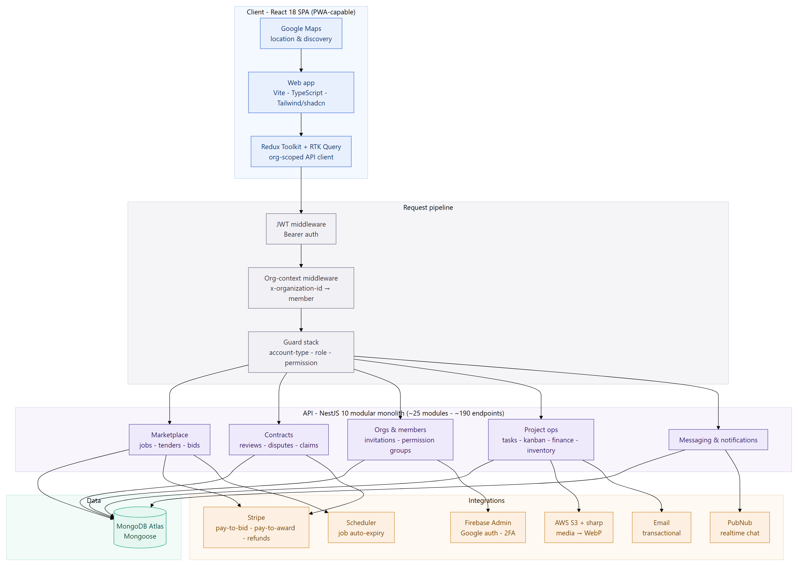
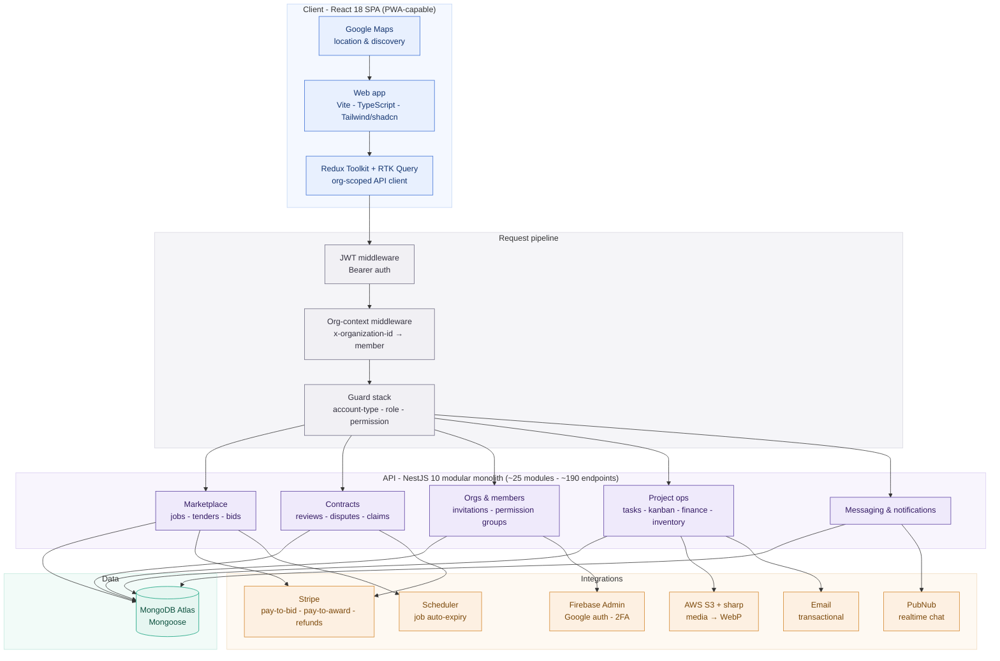
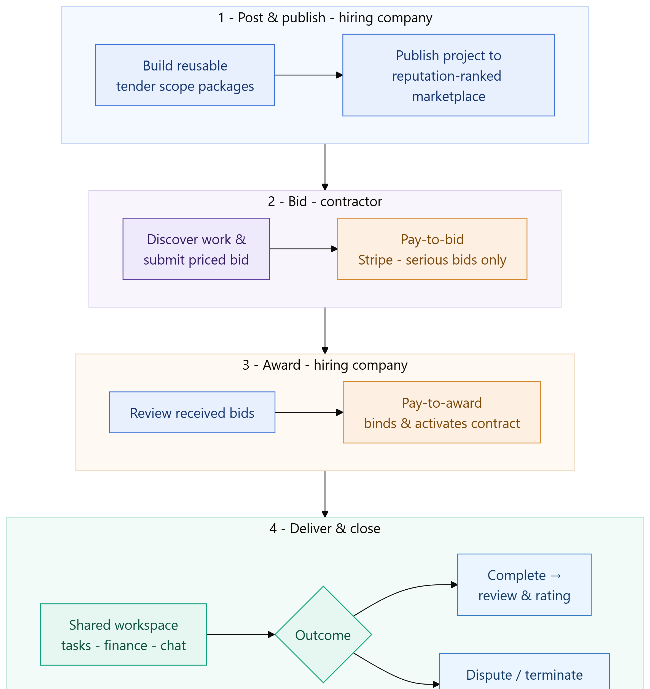
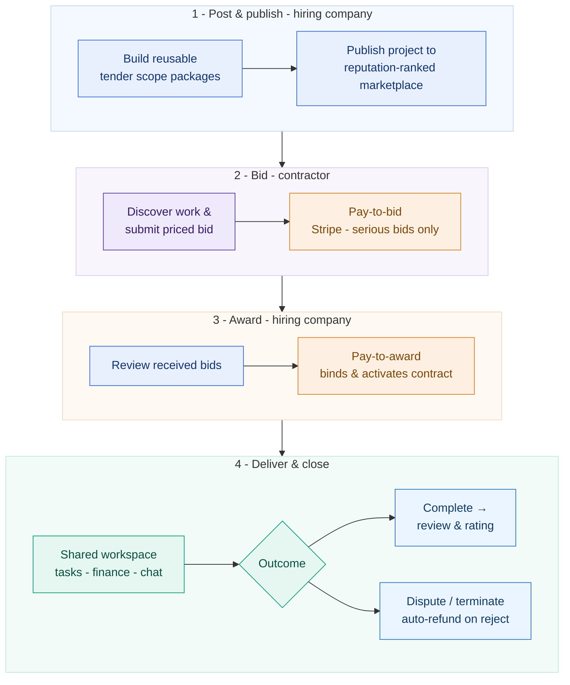
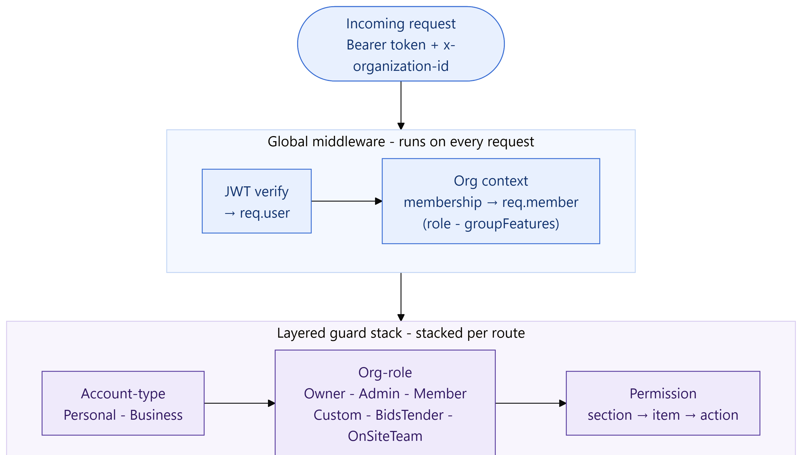
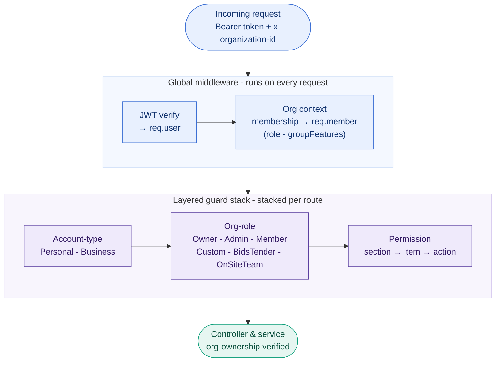

# Construction Bidding & Procurement Marketplace

## ⚠️ Proprietary Work & Copyright Notice

This case study represents proprietary methodologies and NDA-compliant frameworks.

**This project is NOT open-source.**

© 2026 Rohail K. Malhi. All rights reserved.

You are welcome to read and review these materials to understand my professional capabilities. However, you are **strictly prohibited** from copying, adapting, or utilizing these artifacts, structures, or content in any form. See [LICENSE](LICENSE).

---

**A multi-tenant, two-sided marketplace that takes construction procurement online end to end — companies post projects built from reusable scope packages, contractors submit paid, priced bids to win the work, and awarded contracts run in a shared post-award workspace with payments, reviews, disputes, and real-time collaboration.**

> **Confidentiality note.** This is a sanitized portfolio overview. The client identity, product name, brand assets, proprietary business rules, and internal source are withheld under NDA. Everything here describes capabilities and engineering approach at a level safe for public sharing. Endpoint/module counts are drawn from the delivered codebase; commercial figures are intentionally omitted.

---

## Challenge

Construction procurement — a company sourcing subcontractors, or a contractor finding work — still runs on email threads, phone calls, spreadsheets, and word of mouth. That informality creates real friction on both sides of the deal:

- **No trusted marketplace.** Project owners and contractors have no single, searchable place to find each other, ranked by location, reputation, and track record.
- **Unstructured bidding.** Scope lives in scattered documents; proposals arrive as PDFs and emails with no consistent, comparable, priced format.
- **No commitment on either side.** Free, frictionless bidding invites low-quality spam; a verbal "you're hired" isn't a binding award. There's nothing to signal that a bid — or an award — is serious.
- **Work scatters after the handshake.** Once a contract starts, tasks, budgets, material requests, files, and conversations spread across half a dozen disconnected tools.
- **No reputation layer.** Without verified reviews and ratings, it's hard to tell a reliable contractor from an unproven one.
- **Multi-company reality is ignored.** A single professional often works across several companies and needs different permissions in each — something consumer tools simply don't model.

The client needed a platform that turned this whole lifecycle — **discover → bid → award → deliver** — into one governed, monetized, multi-tenant product.

---

## Solution

We designed and built a **two-sided construction bidding marketplace** as a cloud-native platform: a React single-page application (installable, mobile-ready) backed by a modular NestJS API with a MongoDB data layer. It carries the full commercial lifecycle, with **money and trust built into the transaction** rather than bolted on.

### The hire side — post & discover
- **Projects from reusable scope packages.** A company builds one or more **tenders** (reusable scope/skill/budget packages) through a guided multi-step wizard, then attaches them to a published **project** (job). Publishing cascades the scope live to a searchable marketplace.
- **Ranked discovery.** Buyers and contractors browse a public marketplace with debounced search, feeds ("latest", "for you", "expiring soon"), and a location-and-reputation ranking aggregation that scores organizations by proximity, average rating, completed projects, and profile completeness.
- **Reputation-aware.** "Top-rated contractor" and "top specialisation" discovery surface proven performers.

### The get-hired side — bid & win
- **Structured, priced bids.** Contractors submit a bid against a project's scope — specialization, timeline, price, and attachments — in one consistent format.
- **Pay-to-bid.** Submitting a bid requires an upfront payment via Stripe, so only serious proposals enter the funnel. A bid isn't live until the payment clears (confirmed by webhook).
- **Pay-to-award.** To award, the hiring company pays an acceptance fee through Stripe; on confirmation the bid becomes a binding, **active contract** and the project flips to active. Rejecting a paid bid issues an **automatic full refund**.

### The post-award workspace
Once a contract is active, both parties work in a shared project space:
- **Tasks & kanban** — tasks with nested subtasks and assignees; per-project boards with lists, cards, and drag-to-reorder.
- **Project finance** — independent ledgers for payments, cash flow (projected vs actual), and cost control (budget vs committed vs actual).
- **Inventory & material requests** — stock/consumable tracking with location history, plus a material-request workflow with priority and status lifecycle.
- **Reviews, disputes & claims** — 1–5★ reviews that feed contractor ratings; a dispute/termination path on the contract; and an invoice-style claim workflow.
- **Messaging & notifications** — real-time direct messaging (PubNub) with a durable inbox, plus system notifications fired as side-effects across the platform.

### Multi-tenant by construction
- **Organizations & teams.** Users create or join organizations; the first member is the Owner. One user can belong to **many** organizations and switch context freely.
- **Header-driven tenancy.** Every request carries an `x-organization-id` header; middleware resolves the caller's membership for *that* organization, so the same identity yields the correct role and permissions per company.
- **A six-role RBAC model with custom groups.** Owner, Admin, Member, plus configurable **Custom / BidsTender / OnSiteTeam** roles driven by a fine-grained, three-level permission matrix (section → item → action), all enforced through a layered guard stack.

---

## Architecture

A React SPA talks to a NestJS **modular monolith** (~25 domain modules, ~190 REST endpoints) over an org-scoped API. Every request runs a two-stage middleware chain (authentication, then organization context) before hitting a stackable guard chain, so multi-tenant authorization is enforced uniformly across the surface.

Diagram source (Mermaid)

**Modular monolith.** Each domain (jobs, bids, tenders, reviews, claims, organizations, members, invitations, permission groups, tasks, kanban, finance ledgers, inventory, messaging, notifications, media, Stripe) is a self-contained NestJS feature module, wired centrally and sharing one connection and one auth layer — the operational simplicity of a monolith with clean domain boundaries.

**Raw-body-aware bootstrap.** The app captures the raw request body so the Stripe webhook can verify signatures cryptographically — the payment lifecycle is driven by verified webhooks, not by trusting the browser's redirect back from checkout.

**Event-consistent side-effects.** Notifications and transactional emails are fired as side-effects of domain events (a bid is paid, a bid is awarded, an invite is accepted), keeping the write path and the communication path decoupled.

### The transaction & contract lifecycle

Money and trust are first-class: a bid costs money to submit, an award costs money to confirm, and every completed contract can be reviewed.

Diagram source (Mermaid)

### Multi-tenant authorization

Tenancy is resolved per request from a header rather than a subdomain or URL, and authorization is composed from small, stackable guards — so the same identity carries different powers in different organizations, and each route declares exactly the account type, role, and permission it needs.

Diagram source (Mermaid)

### Technology

| Layer | Stack |
|---|---|
| **Frontend** | React 18 · TypeScript · Vite · Tailwind CSS + shadcn/ui (Radix) · React Router · React Hook Form + Zod |
| **State / data** | Redux Toolkit + RTK Query (org-scoped API client, auto-injected auth & tenancy headers) |
| **Backend** | NestJS 10 (modular monolith) · Node.js · Passport JWT · class-validator / Zod · Swagger/OpenAPI |
| **Data** | MongoDB Atlas via Mongoose (denormalized snapshots, compound unique indexes for tenancy invariants) |
| **Payments** | Stripe — one-time checkout for pay-to-bid & pay-to-award, saved cards, refunds, signature-verified webhooks |
| **Media** | AWS S3 + `sharp` (server-side image normalization → WebP), immutable public URLs |
| **Identity** | Firebase Admin (Google sign-in) · JWT sessions · TOTP two-factor (speakeasy/QR) |
| **Realtime** | PubNub (direct messaging) with a durable backend inbox |
| **Maps** | Google Maps (location capture, proximity ranking) |
| **Platform** | AWS App Runner · scheduled jobs (`@nestjs/schedule`) · transactional email |

---

## Engineering highlights

- **Money built into the funnel.** Pay-to-bid and pay-to-award turn a directory into a marketplace with real commercial commitment on both sides — with the entire payment state machine driven by **verified Stripe webhooks** and idempotent handlers, plus automatic full refunds on rejection.
- **Multi-tenant from request one.** Header-driven organization context + a layered guard stack (authentication → account type → org role → fine-grained permission) means one account operates safely across many companies, each with its own role and permission matrix.
- **Composable, declarative authorization.** Guards and metadata decorators let each of ~190 endpoints declare precisely the account type, role, and permission it requires, with per-organization ownership checks rejecting cross-tenant access.
- **Reputation as a first-class system.** Reviews roll up into contractor ratings that feed a location-and-reputation ranking aggregation powering discovery — closing the trust loop.
- **A shared post-award workspace.** Tasks, kanban, three finance ledgers, inventory, material requests, messaging, and notifications turn "you won the bid" into an actual place to run the job.
- **Installable, responsive client.** A Vite/React SPA with code-split lazy routes, a shared design system, real-time chat, and maps — tuned to work across mobile and desktop.
- **Cloud-native delivery.** Deployed on AWS App Runner with S3-backed media, scheduled background jobs (automatic listing expiry), and OpenAPI documentation for the whole API.

---

## At a glance

A multi-tenant, two-sided construction bidding marketplace that takes procurement online end to end: companies assemble projects from reusable scope packages and publish them to a searchable, reputation-ranked marketplace; contractors win work through structured, **paid** bids; awards are confirmed with a Stripe acceptance payment that binds the contract; and delivery runs in a shared workspace with finance ledgers, tasks, inventory, reviews, disputes, and real-time messaging — all governed by per-organization, role-based access control across a ~25-module, ~190-endpoint NestJS API and an installable React client.

---

> *Notice: This case study has been modified to comply with confidentiality agreements. The resulting framework and artifacts remain the strict intellectual property of Rohail K. Malhi and may not be duplicated or repurposed.*
