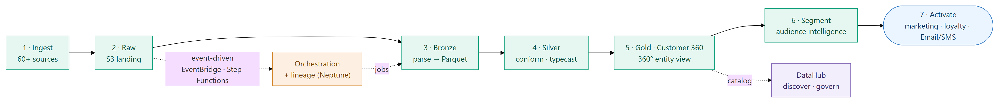
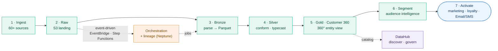
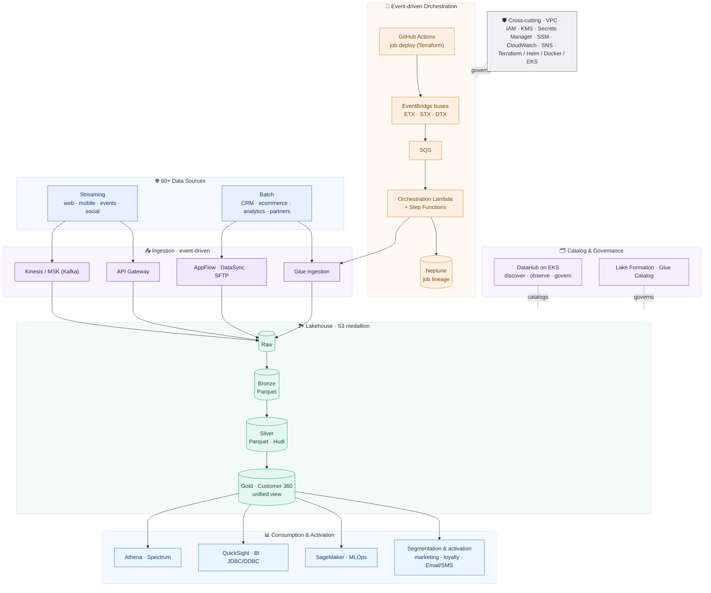

# Customer-360 Data Lakehouse & Data Catalog

## ⚠️ Proprietary Work & Copyright Notice

This case study represents proprietary methodologies and NDA-compliant frameworks.

**This project is NOT open-source.**

© 2026 Rohail K. Malhi. All rights reserved.

You are welcome to read and review these materials to understand my professional capabilities. However, you are **strictly prohibited** from copying, adapting, or utilizing these artifacts, structures, or content in any form. See [LICENSE](LICENSE).

---

**An event-driven data lakehouse on AWS that unifies 60+ data sources into a single, governed 360° view of every customer — powering real-time audience segmentation, analytics, and multi-channel activation, with a self-service data catalog on top.**

> **Confidentiality note.** This is a sanitized portfolio overview. The client identity, internal project/component names, proprietary business rules, and internal source are withheld under NDA. Everything here describes capabilities and engineering approach at a level safe for public sharing. Screenshots are from a demo/dev environment with account identifiers, personal names, and internal codenames removed. Outcome figures are representative and anonymized.

> 📄 **Client-facing case study (C-S-R):** [`customer_360_data_lakehouse_case_study.pdf`](customer_360_data_lakehouse_case_study.pdf) — a polished, shareable PDF with Challenge → Solution → Result, embedded screenshots (identifiers redacted).

---

## The problem

A large **media & publishing organization** — dozens of print and digital titles, apps, classifieds, radio, and video — wanted a data-driven growth strategy, but its data was hopelessly siloed:

- **60+ disconnected sources.** Customer and event data lived across CRM, ecommerce, web, mobile apps, ad platforms, video/streaming, social, and partners — with no unified collection or activation.
- **No single customer view.** There was no cross-domain, 360° picture of an entity (a reader/customer), so real-time, targeted engagement was impossible.
- **Slow to add data.** Standing up a new data pipeline was a bespoke, weeks-long effort with no reusable framework.
- **No lineage or governance.** Teams couldn't trace where data came from, what depended on what, or discover what data products already existed.
- **Tool sprawl.** Every department used different query engines and BI tools, with no single place to find, understand, and trust data.

They needed a **lakehouse platform** that unifies ingestion, builds a governed 360° view, lets the team ship new pipelines in days, and gives every staff member one place to discover and use data.

---

## What it does

Raw events from every source flow through a governed **medallion** pipeline (Raw → Bronze → Silver → Gold) into a unified 360° entity view — then out to segmentation, BI, ML, and activation. Every job is orchestrated by an event-driven engine and catalogued for discovery.

Mermaid source (renders live on GitHub)

### Unified ingestion (60+ sources)
- One framework to **collect, ingest, and activate** event data from every source — streaming (web, mobile, events, social) and batch (CRM, ecommerce, analytics, partners).
- Streaming via Kinesis / MSK (Kafka); batch via AppFlow, DataSync, SFTP, and Glue.

### Medallion lakehouse (Raw → Bronze → Silver → Gold)
- **Raw** — every source landed in S3 in original form.
- **Bronze** — nested JSON parsed to a linear schema, written as **Parquet**; Glue crawlers keep partitions fresh.
- **Silver** — columns conformed to naming standards and cast to correct types (Parquet / Hudi).
- **Gold — Customer 360** — ETL builds a **unified, cross-domain 360° view** of each entity's attributes and behaviors, enabling real-time, targeted audience segmentation.

### Event-driven orchestration
- Jobs are **decoupled from orchestration** and each other — no tight coupling, no cascading failures.
- Three trigger modes on an EventBridge event bus: **Event-triggered (ETX)**, **Scheduled (STX)**, and **Dependency-triggered (DTX)** execution.
- **Job inheritance + reusable core functionality** means new pipelines ship in **days**, and jobs are added to orchestration automatically via **GitHub Actions**.
- Full **lineage & metadata** for every schedule and job (graph-backed), so any asset's dependencies can be traced to source.

### DataHub — self-service data catalog
- One simple interface for **all staff** to **navigate, search, discover, observe, govern, and use** data products — hundreds of datasets across the medallion layers in one place.

### Segmentation, analytics & activation
- **Real-time, targeted audience segmentation** off the Gold layer.
- **Analytics & BI** (Athena / Spectrum, QuickSight, JDBC/ODBC) and **ML/MLOps** (SageMaker).
- **Multi-channel activation** — marketing, retention, loyalty, personalization, contact centers, chat, Email/SMS, and social.

---

## Architecture

An event-driven, medallion **lakehouse** on AWS: unified ingestion, a governed Raw→Bronze→Silver→Gold pipeline on S3, an event-driven orchestration/lineage engine, a consumption & activation layer, and a DataHub catalog — all provisioned as code.

Mermaid source (renders live on GitHub)

**Medallion lakehouse.** Data is progressively refined across S3 zones — Raw (as-is) → Bronze (parsed Parquet) → Silver (conformed/typed) → Gold (the Customer 360 unified view) — with Glue for ETL/crawlers, Athena for query, and Lake Formation + Glue Catalog for governance.

**Event-driven orchestration.** The platform's key architectural bet: jobs and orchestration are fully decoupled via an EventBridge event bus. Jobs listen for events and run independently (ETX/STX/DTX) with no cascading effects, coordinated by Step Functions and Lambda. Every run's metadata is captured for lineage in a graph store (Neptune), and new jobs are deployed straight into orchestration by GitHub Actions.

**A pipeline framework, not one-off pipelines.** Job inheritance and reusable core functionality turn "build a new pipeline" from a multi-week project into a couple of days' work — while guaranteeing consistent logging, tracing, and lineage.

**Self-service governance.** DataHub (on EKS) gives every staff member one interface to discover, observe, and govern data products; Lake Formation enforces fine-grained access on the lake.

**Everything as code.** The platform is provisioned and operated with Terraform, Helm, Docker, and EKS, with GitHub Actions CI/CD.

### Technology

| Layer | Stack |
|---|---|
| **Data pipelines / ETL** | Python · PySpark · AWS Glue · DataBrew |
| **Lakehouse storage** | Amazon S3 (medallion: Raw / Bronze / Silver-Hudi / Gold) · Parquet |
| **Streaming** | Amazon MSK (Kafka) · Kinesis · AppFlow · DataSync |
| **Query & consumption** | Athena · Redshift Spectrum · QuickSight · JDBC/ODBC |
| **ML** | SageMaker (MLOps) |
| **Orchestration** | EventBridge · SQS · Step Functions · Lambda (ETX / STX / DTX) |
| **Lineage / metadata** | Amazon Neptune (graph) · DataHub |
| **Catalog & governance** | DataHub (on EKS) · AWS Lake Formation · Glue Catalog |
| **Databases** | MySQL · Amazon Neptune |
| **Search** | Amazon OpenSearch |
| **Platform / infra** | VPC · IAM · KMS · Secrets Manager · SSM Parameter Store · CloudWatch · SNS · EKS |
| **IaC / DevOps** | Terraform · Helm · Kubectl · Docker · GitHub Actions |

---

## Engineering highlights

- **A 360° view from 60+ sources.** The core value is unifying wildly heterogeneous data into one governed, cross-domain entity view that segmentation and activation can act on in real time.
- **Decoupled, event-driven orchestration.** ETX/STX/DTX triggers on an EventBridge bus let jobs run independently with no cascading failures — orchestration and jobs evolve separately.
- **New pipelines in days, not weeks.** A standardized framework with job inheritance and reusable core functionality, with jobs deployed to orchestration automatically by GitHub Actions.
- **Lineage you can trust.** Every schedule and job records metadata into a graph store, so any asset's dependencies are traceable right to source.
- **Self-service data culture.** DataHub gives the whole organization one place to discover, understand, and govern hundreds of data products.
- **Fully codified platform.** Terraform/Helm/Docker/EKS make the entire environment reproducible and replicable across accounts.

---

## At a glance

An event-driven, medallion data lakehouse on AWS that unifies 60+ sources into a governed 360° customer view — Raw→Bronze→Silver→Gold on S3 (Glue/Athena/Lake Formation), decoupled ETX/STX/DTX orchestration (EventBridge/Step Functions/Lambda) with graph-based lineage (Neptune), streaming via MSK/Kinesis, ML via SageMaker, and a DataHub self-service catalog — enabling real-time audience segmentation and multi-channel activation, all provisioned as code.

---

> *Notice: This case study has been modified to comply with confidentiality agreements. The resulting framework and artifacts remain the strict intellectual property of Rohail K. Malhi and may not be duplicated or repurposed.*
