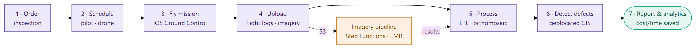
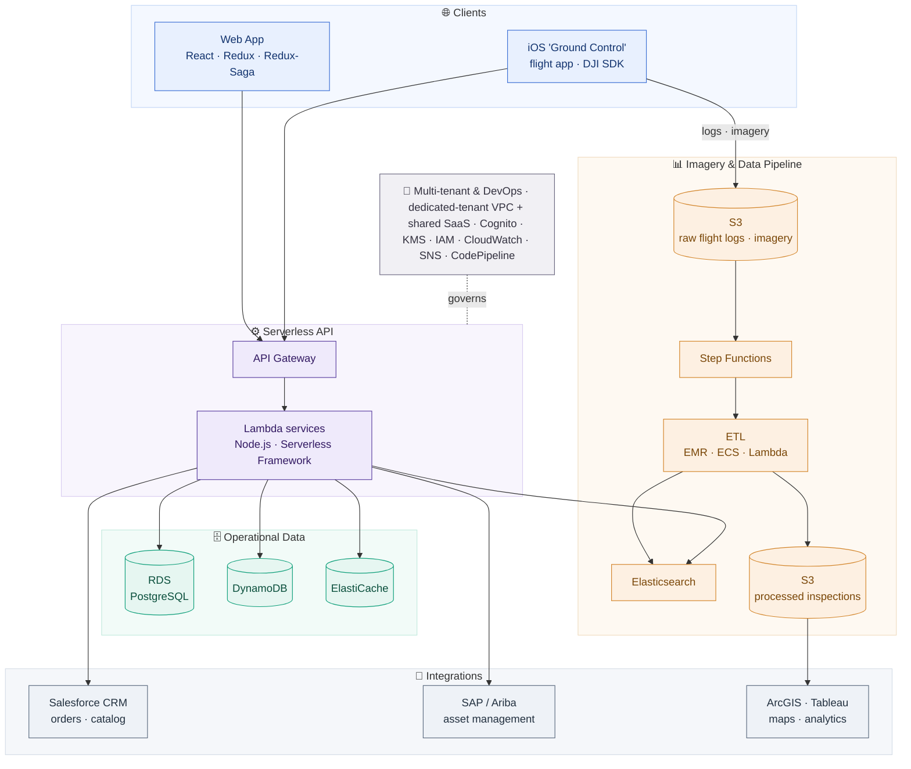

# Enterprise Drone Operations & Inspection-Analytics Platform

## ⚠️ Proprietary Work & Copyright Notice

This case study represents proprietary methodologies and NDA-compliant frameworks.

**This project is NOT open-source.**

© 2026 Rohail K. Malhi. All rights reserved.

You are welcome to read and review these materials to understand my professional capabilities. However, you are **strictly prohibited** from copying, adapting, or utilizing these artifacts, structures, or content in any form. See [LICENSE](LICENSE).

---

**A multi-tenant, serverless AWS platform that runs the full drone-inspection lifecycle for energy infrastructure — order, schedule, fly, ingest imagery, detect defects, and deliver geolocated analytics — turning raw drone flights into actionable, auditable asset-inspection reports.**

> **Confidentiality note.** This is a sanitized portfolio overview. The client and customer identities, product name, proprietary business rules, and internal source are withheld under NDA. Everything here describes capabilities and engineering approach at a level safe for public sharing. Screenshots are from a demo/test environment with client and customer logos, order IDs, site names, and geolocation removed. Outcome figures are representative and anonymized.

> 📄 **Client-facing case study (C-S-R):** [`drone_operations_inspection_platform_case_study.pdf`](drone_operations_inspection_platform_case_study.pdf) — a polished, shareable PDF with Challenge → Solution → Result, embedded screenshots (logos redacted).

---

## The problem

An enterprise **drone-services company** ran inspections of energy infrastructure — solar farms, wind, oil & gas — for large industrial customers. The operation worked, but it ran on a patchwork: phone/email orders, spreadsheets for scheduling pilots and drones, a Heroku/Rails interim app, and manual hand-off of raw flight logs and imagery to analysts. An anchor customer (a global energy operator) wanted to adopt drone inspection at scale across its business units.

That created hard problems:

- **Orders lived in email.** Estimates, purchase orders, and inspection requests were untracked and slow — with no online funnel from request to completed inspection.
- **No standardization.** Every inspection was scheduled, flown, processed, and reported differently, so cost, quality, and turnaround varied wildly.
- **Imagery didn't become insight.** Gigabytes of drone flight logs and aerial imagery were collected, but turning them into geolocated defect maps and analytics was manual and slow.
- **No visibility.** Neither the operator nor its customers could see inspection KPIs, cost/time savings vs. manual inspection, or an audit trail of decisions.
- **It had to scale beyond one customer.** The platform had to serve the anchor customer as an isolated tenant *and* be resold as multi-tenant SaaS to the broader energy industry.

---

## What it does

The platform digitizes the entire order-to-insight lifecycle of a drone inspection, so a request becomes a geolocated, analyzed, auditable report — with heavy imagery processing pushed to an asynchronous pipeline.

```mermaid
flowchart LR
    A["1 · Order<br/>inspection"] --> B["2 · Schedule<br/>pilot · drone"]
    B --> C["3 · Fly mission<br/>iOS Ground Control"]
    C --> D["4 · Upload<br/>flight logs · imagery"]
    D --> E["5 · Process<br/>ETL · orthomosaic"]
    E --> F["6 · Detect defects<br/>geolocated GIS"]
    F --> G(["7 · Report &amp; analytics<br/>cost/time saved"])
    D -. "S3" .-> LK["Imagery pipeline<br/>Step Functions · EMR"]
    LK -. results .-> E

    classDef step fill:#efeafb,stroke:#5b3fa0,color:#331a63;
    classDef out fill:#e6f6f1,stroke:#0e9f7a,color:#0a4f3c;
    classDef lk fill:#fdf0e2,stroke:#d3852a,color:#7a4708;
    class A,B,C,D,E,F step;
    class G out;
    class LK lk;
```

Mermaid source (renders live on GitHub)

### Order & workflow management
- Online **order management** for inspection estimates and orders, with purchase-order upload, review/confirmation screens, and status tracking — replacing email-and-spreadsheet ordering.
- A configurable **workflow engine** orchestrates the tasks that move an order from request → scheduled → flown → processed → delivered.
- **Email + in-app notifications** on order events and workflow transitions.

### Scheduling & resourcing
- Schedule and assign **pilots, data analysts, and drones** to missions — including the customer's own resources alongside the operator's.

### Flight capture (mobile)
- A native **iOS "Ground Control" flight app** (DJI SDK) for drone control and structured capture of flight logs and imagery, uploading securely to cloud storage.
- In-portal **flight-log replay** — an aerial map with the flown path, an attitude indicator, and synchronized telemetry (altitude, GPS) on a scrub timeline.

### Imagery processing & defect analytics
- An **asynchronous imagery pipeline** ingests raw flight logs and imagery and produces **orthomosaics** and processed inspection data.
- **Geolocated defect detection** presented on an interactive GIS map (via ArcGIS), classifying damage (e.g. sub-module / module / string on solar) with per-defect location, imagery, and downloadable inspection reports, visualizations, and raw data.
- **Inspection analytics** — defects by type, damage classification, and proximity metrics.

### Platform analytics & reporting
- Executive **platform analytics**: orders and flights over time, order mix by vertical (solar / wind / oil & gas), a submitted→scheduled→flown→completed funnel, and **cost and time saved vs. manual inspection**.
- Multi-level **reporting** across drones, inspections, and personnel utilization with filtering and sorting.

### Multi-tenancy, admin & integrations
- **Multi-tenant** by design: an **isolated dedicated tenant** (its own VPC) for the anchor customer, plus **shared SaaS tenancy** for resale to other customers — with per-customer branding (logo, colors).
- **Platform admin** for users, roles, and sites.
- Enterprise **integrations**: Salesforce CRM (orders & product catalog), SAP / Ariba (asset management), NetSuite (finance), ArcGIS (maps), and Tableau (analytics).
- **Responsive, adaptive UI** across desktop, tablet, and phone.

---

## Architecture

A serverless, event-driven system on AWS: web and mobile clients, a serverless API tier, an operational data store, and an asynchronous imagery/data pipeline that scales heavy image processing independently of the interactive app.

Mermaid source (renders live on GitHub)

**Serverless-first.** The API tier is AWS Lambda behind API Gateway, packaged and deployed with the Serverless Framework — usage-based scale and no server fleet to run.

**Imagery scales outside the request path.** Drone flight logs and imagery upload directly to S3; a Step Functions–orchestrated pipeline (EMR / ECS / Lambda) transforms raw captures into orthomosaics and processed inspection data, indexed in Elasticsearch and surfaced through ArcGIS/Tableau — so heavy image processing never blocks the interactive portal.

**Multi-tenant by construction.** The anchor customer runs in a dedicated tenant with its own VPC (peered to the customer network), while additional customers are served as shared-tenant SaaS — the same platform, isolated appropriately per contract.

**Integrated with the enterprise.** Orders and the product catalog flow through Salesforce; asset data connects to SAP/Ariba; finance to NetSuite — so the platform fits the operator's existing back office rather than replacing it.

**Secure & operable.** Managed identity (Cognito), encryption (KMS), least-privilege IAM, VPC/VPN isolation, and CloudWatch observability, with CI/CD via CodeCommit → CodePipeline → CodeDeploy.

### Technology

| Layer | Stack |
|---|---|
| **Frontend** | React · Redux · Redux-Saga · responsive/adaptive UI (S3 + CloudFront) |
| **Mobile** | Native iOS "Ground Control" flight app · DJI SDK |
| **Backend** | Node.js · Serverless Framework (AWS Lambda) · Sequelize |
| **Data** | Amazon RDS (PostgreSQL) · DynamoDB · ElastiCache |
| **Imagery / data pipeline** | S3 · Step Functions · EMR · ECS · Lambda · Elasticsearch |
| **Infra / platform** | API Gateway · CloudFront · Cognito · KMS · IAM · SNS · VPC / VPC-peering / VPN |
| **Multi-tenancy** | Dedicated-tenant VPC (anchor customer) + shared-tenant SaaS |
| **Integrations** | Salesforce CRM · SAP / Ariba · NetSuite · ArcGIS Online · Tableau |
| **Observability** | CloudWatch (metrics · logs · dashboards) |
| **CI/CD** | CodeCommit · CodePipeline · CodeDeploy (JIRA-linked release notes · ESLint gates) |

---

## Engineering highlights

- **Turning imagery into geolocated insight.** The core value isn't a form — it's an asynchronous pipeline that ingests raw drone flight logs and imagery and outputs orthomosaics and per-defect, geolocated inspection data rendered on a GIS map.
- **Heavy processing, responsive app.** Image processing runs on Step Functions + EMR/ECS/Lambda against S3, fully decoupled from the interactive portal, so large jobs never degrade the user experience.
- **Two tenancy models, one platform.** A dedicated, VPC-isolated tenant for the anchor customer plus shared-tenant SaaS for resale — designed in from day one, not retrofitted.
- **Mobile-to-cloud flight capture.** A native iOS/DJI flight app captures logs and imagery in the field and syncs to the cloud, with in-portal replay of the flight path and synchronized telemetry.
- **Fits the enterprise.** First-class integrations with Salesforce, SAP/Ariba, and NetSuite so the platform slots into the operator's existing order, asset, and finance systems.
- **Agile delivery at pace.** Delivered as a fixed-scope, milestone-based engagement over a ~15-week / 14-sprint program, with CI/CD, linting gates, and JIRA-linked release notes.

---

## At a glance

A serverless, multi-tenant AWS platform that runs the entire drone-inspection lifecycle for energy infrastructure — online ordering and workflow, pilot/drone scheduling, a native iOS flight app, an asynchronous imagery pipeline that produces orthomosaics and geolocated defect maps, and executive analytics on cost and time saved — integrated with Salesforce, SAP, and NetSuite, and built to serve both a dedicated anchor tenant and shared-SaaS customers.

---

> *Notice: This case study has been modified to comply with confidentiality agreements. The resulting framework and artifacts remain the strict intellectual property of Rohail K. Malhi and may not be duplicated or repurposed.*
