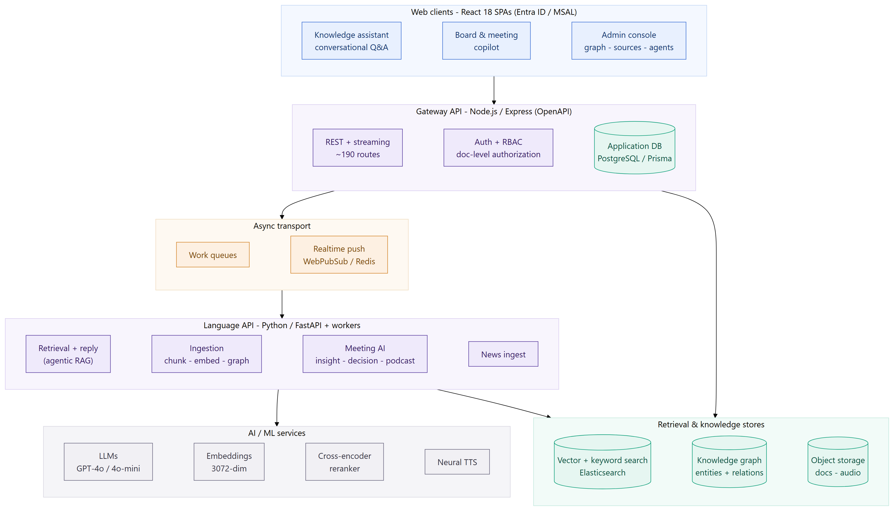
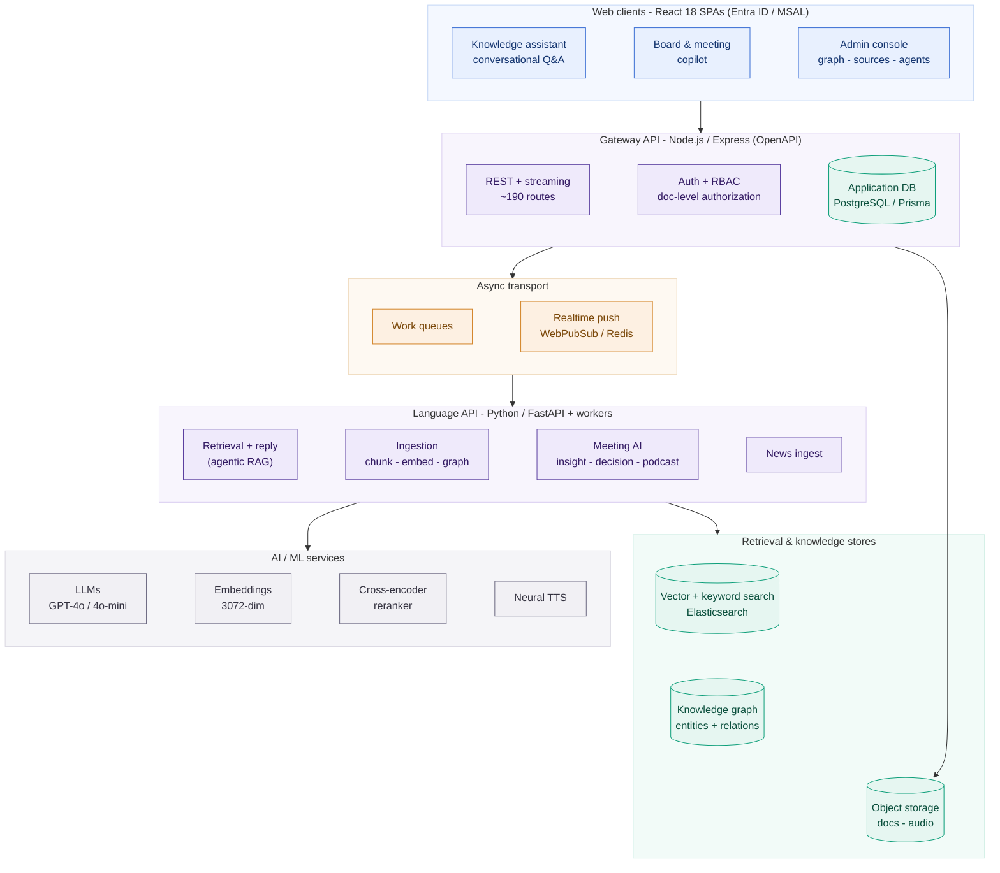
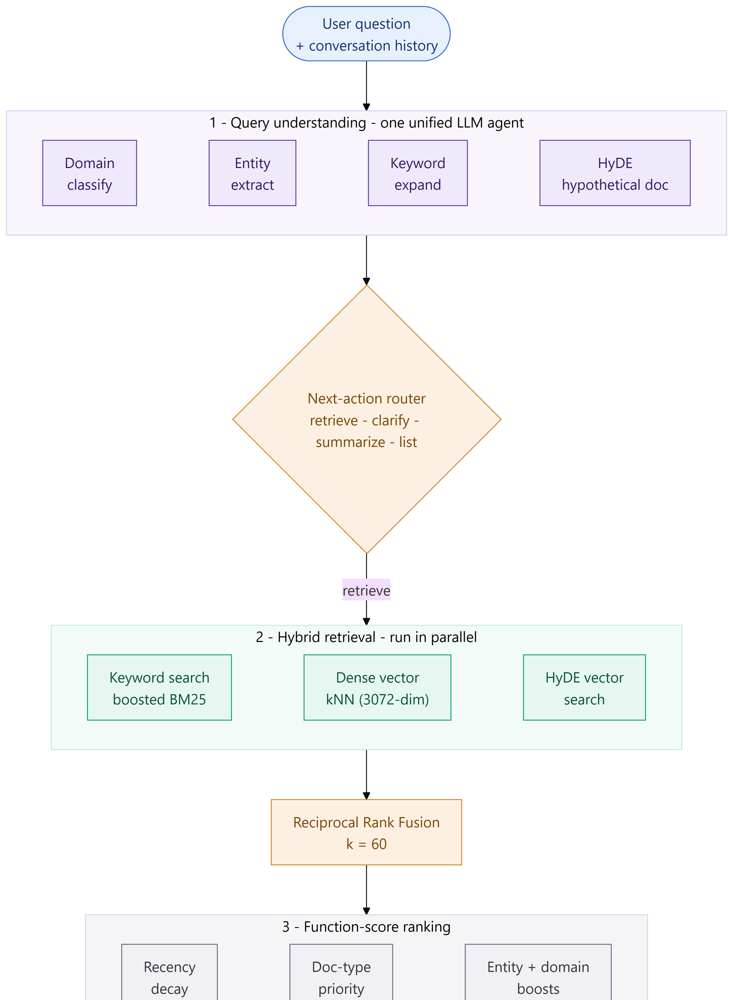
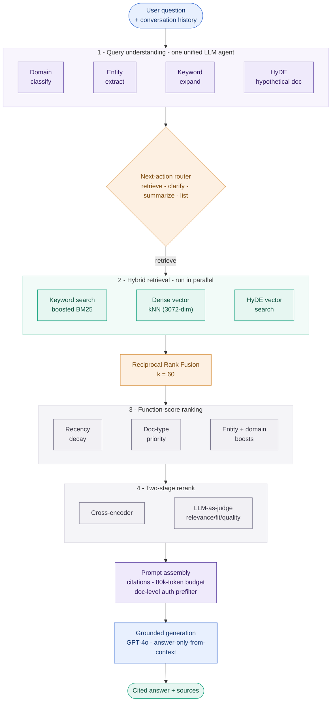
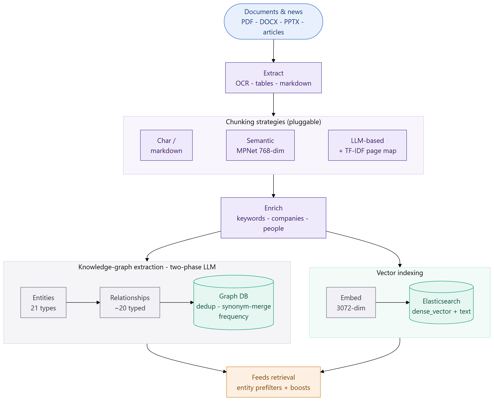
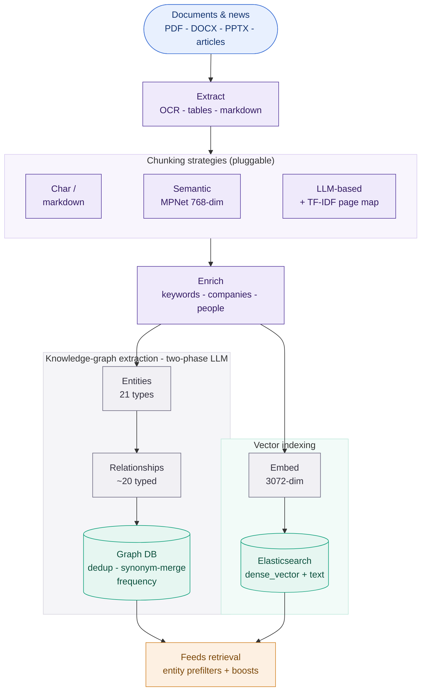
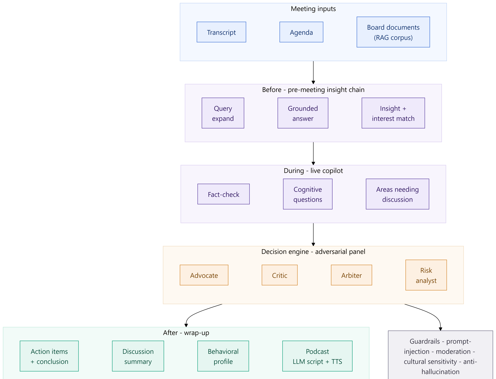
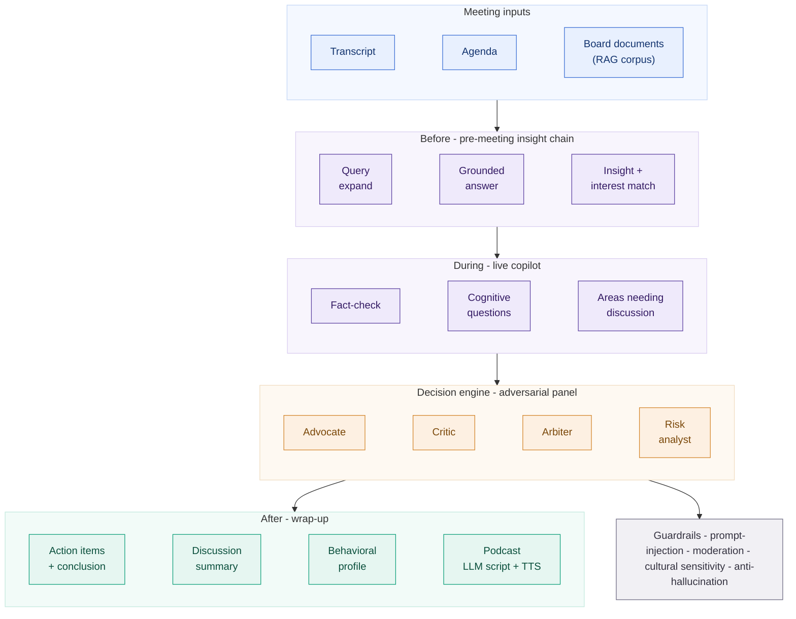

# Enterprise AI Knowledge & Retrieval Platform

## ⚠️ Proprietary Work & Copyright Notice

This case study represents proprietary methodologies and NDA-compliant frameworks.

**This project is NOT open-source.**

© 2026 Rohail K. Malhi. All rights reserved.

You are welcome to read and review these materials to understand my professional capabilities. However, you are **strictly prohibited** from copying, adapting, or utilizing these artifacts, structures, or content in any form. See [LICENSE](LICENSE).

---

**A private, enterprise-grade generative-AI platform for a large diversified holding group — a conversational assistant that answers questions over the organization's entire document corpus with citations, and a board-meeting copilot that prepares, fact-checks, and stress-tests decisions live. Under the hood: agentic Retrieval-Augmented Generation with hybrid search, a knowledge graph, two-stage reranking, and a fleet of specialized LLM agents, all grounded, permissioned, and observable.**

> **Confidentiality note.** This is a sanitized portfolio overview. The client identity, product names, brand assets, proprietary prompts, business rules, model deployment names, and internal source are withheld under NDA. Everything here describes AI/ML capabilities and engineering approach at a level safe for public sharing. Technique parameters (e.g. fusion constants, embedding dimensions, token budgets) are generic and reveal no client data; commercial figures and any confidential content are intentionally omitted.

---

## Challenge

A large, diversified holding group sits on an enormous, ever-growing body of institutional knowledge — board packs, financials, policies, legal agreements, rate cards, meeting minutes, and a constant stream of market news — spread across hundreds of documents and dozens of subsidiaries. Two problems compounded each other:

- **Answers were trapped in documents.** Executives and analysts couldn't ask a plain-English question ("what did we decide about X last quarter, and why?") and get a trustworthy, *sourced* answer. Keyword search returned files, not answers, and generic chatbots hallucinate — unacceptable when a wrong number reaches a board.
- **Board meetings ran on human memory.** Preparing for a board or executive meeting meant manually reading everything; during the meeting there was no way to fact-check a claim, surface a related past decision, or pressure-test a recommendation in real time; afterwards, capturing decisions and follow-ups was manual.
- **Knowledge was siloed and unconnected.** The relationships that matter — which subsidiary supplies which, which risk touches which portfolio, who owns which initiative — lived only in people's heads, never in a queryable form.
- **Trust, security, and governance were non-negotiable.** Every answer had to be grounded in *authorized* source documents only, per-user and per-document; nothing could leak across permission boundaries; and every AI response had to be traceable and measurable.

They needed a private generative-AI platform that could **read everything, answer anything it was allowed to, cite its sources, and never make things up** — and then go further, turning that same intelligence into an active copilot for their most important meetings.

---

## Solution

A two-part platform over a shared AI core:

1. **A conversational knowledge assistant** — ask a question in natural language, get a grounded, cited answer drawn only from documents the user is authorized to see.
2. **A board & meeting copilot** — a suite of AI agents that generate pre-meeting insights, fact-check and surface questions live, run an adversarial decision panel, and produce action items, summaries, and even an audio "meeting podcast" afterward.

Both sit on one **agentic Retrieval-Augmented Generation (RAG)** engine engineered for accuracy and trust rather than a thin wrapper around a chat model.

### The retrieval engine — accuracy by construction
- **Query understanding first.** A single unified LLM agent reads the question and conversation history and, in one call, classifies the domain, extracts named entities, expands keywords/synonyms, and writes a **HyDE** hypothetical answer — consolidating what used to be five separate LLM calls into one for a large cost reduction.
- **Agentic routing.** A next-action router decides whether to retrieve, ask a clarifying question, summarize, or list files, so the system doesn't blindly search when it shouldn't; a second router picks the right knowledge scope (current session vs. historical corpus).
- **Hybrid retrieval, three ways at once.** Keyword (boosted BM25 with phrase matching), dense-vector kNN over high-dimensional embeddings, and a HyDE vector search all run in parallel, then merge through **Reciprocal Rank Fusion** — catching matches that any single method would miss.
- **Signal-aware ranking.** Fused results are re-scored with a function-score layer: Gaussian **recency decay**, document-type priority, year-range and domain-specific boosts, and entity/company/people boosts — tuned per domain (financial, policy, legal, board, and more).
- **Two-stage reranking.** A cross-encoder reranks the shortlist, then an **LLM-as-judge** contextual reranker scores each passage on query-relevance, context-fit, and information-quality before the best context is kept.

### Grounded, trustworthy generation
- **Answer only from authorized context.** A document-level authorization prefilter is pushed *into* the search itself, so a user can never retrieve — let alone be answered from — a document they aren't permitted to see.
- **Citations as a first-class citizen.** Every passage carries a composite identity (document, page, chunk); the model is prompted to cite numbered sources for each claim, and the UI links answers back to exact pages.
- **Budgeted context.** A greedy token-budget packer fills a large context window while preserving fusion rank order, so the most relevant evidence always makes it in.
- **Guardrails.** A prompt-injection input guardrail and a moderation agent gate every request; an "answer-only-from-context" mode forbids the model from falling back on general knowledge; and domain-appropriate sensitivity checks apply.

### A knowledge graph woven into retrieval
- **Two-phase LLM extraction.** During ingestion, one agent extracts typed **entities** (organizations, people, sectors, products, risks, reports, and more), then a second agent — given only those approved entities — extracts typed **relationships** (supplies, operates-in, reports-to, exposed-to, …). Splitting the two phases measurably improved quality and cut hallucinated links.
- **A living graph.** Entities are de-duplicated and merged across documents, synonyms reconciled, and source frequencies tracked. The graph both powers a visual explorer and **feeds retrieval** — entity-aware prefilters and boosts sharpen every search.

### The meeting copilot — intelligence in the room
- **Before:** per-agenda-item insight chains generate grounded briefings matched to each participant's interests.
- **During:** live fact-checking, cognitive-question generation, and "areas needing discussion" prompts.
- **Decision support:** an **adversarial panel** of agents — advocate, critic, arbiter, and risk analyst — argues a recommendation from multiple angles before it's put to the room.
- **After:** automatic action items, conclusions, discussion summaries, behavioral-interest profiles, and an LLM-scripted, text-to-speech **"meeting podcast"** recap.

### Built to scale and be trusted operationally
A Python **FastAPI** "language" service plus a fleet of queue-driven workers (ingestion, retrieval/reply, news, podcast, graph cleanup) sit behind a Node.js gateway and React clients. Everything is instrumented with **OpenTelemetry** distributed tracing, per-response **token-and-entity metrics**, and offline evaluation tooling — so AI behavior is observable and measurable, not a black box.

---

## Architecture

Three surfaces — a knowledge-assistant SPA, a board-meeting SPA, and an admin console — talk to a Node.js/Express gateway (auth, RBAC, application data) that brokers to a Python/FastAPI "language" service and its workers over async queues, with real-time answers streamed back to the browser. The AI/ML core (LLMs, embeddings, reranker, neural TTS) and the retrieval/knowledge stores (vector + keyword search, knowledge graph, object storage) sit behind the language service.

Diagram source (Mermaid)

**Two services, one contract.** A TypeScript gateway (Express, OpenAPI-validated, PostgreSQL via Prisma) owns identity, authorization, and application state; a Python/FastAPI service owns everything AI. They talk synchronously for fast paths and via durable **work queues** for long jobs (ingestion, podcast generation, meeting analysis), with results streamed to the browser over a real-time channel — so a one-hour podcast render never blocks a request.

### The agentic RAG retrieval pipeline

This is the heart of the platform: turning a natural-language question into a grounded, cited answer.

Diagram source (Mermaid)

**Why hybrid + fusion.** Keyword search nails exact terms and identifiers; dense vectors capture meaning; HyDE bridges the vocabulary gap between how people ask and how documents are written. Reciprocal Rank Fusion (k = 60) merges all three ranked lists without hand-tuned weights, then the function-score and rerank stages push the genuinely best evidence to the top.

### Ingestion & the knowledge graph

Every document flows through a pluggable chunking pipeline into both a vector index (for retrieval) and a two-phase LLM graph extraction (for connected knowledge) — and the graph loops back to make retrieval smarter.

Diagram source (Mermaid)

**Chunking is a strategy, not a constant.** Character, markdown-aware, embedding-based **semantic** (percentile-breakpoint over sentence-window embeddings), and **LLM-based** chunking (with TF-IDF page attribution) are all pluggable — because the right chunk boundary for a legal contract isn't the right one for a slide deck. OCR cleanup, table extraction, and per-chunk enrichment (keywords, companies, people) run before both indexing and graph extraction.

### The board & meeting copilot

The same grounded intelligence, reshaped into a meeting workflow with a multi-agent decision panel.

Diagram source (Mermaid)

### Technology

| Layer | Stack |
|---|---|
| **AI orchestration** | Agentic RAG · OpenAI Agents SDK · LangChain · LiteLLM · unified query-understanding, next-action & database routing agents |
| **LLMs** | Azure OpenAI — GPT-4o (reasoning/synthesis) · GPT-4o-mini (routing/classification), temperature 0, seeded, streaming |
| **Retrieval** | Hybrid keyword + dense-vector kNN + HyDE · Reciprocal Rank Fusion (k=60) · function-score (recency decay, doc-type priority, entity/domain boosts) |
| **Embeddings** | 3072-dim document/query embeddings; 768-dim MPNet sentence embeddings for semantic chunking |
| **Reranking** | Cross-encoder (`sentence-transformers`) microservice + LLM-as-judge contextual reranker (relevance / context-fit / quality weighting) |
| **Knowledge graph** | Two-phase LLM entity + relationship extraction (21 entity types, ~20 typed relations) · graph store with dedup, synonym-merge & frequency |
| **Search / data** | Elasticsearch (`dense_vector` + text, function-score) · graph database · PostgreSQL (Prisma) · Redis · object/blob storage |
| **Chunking / NLP** | Pluggable char / markdown / semantic / LLM chunkers · `tiktoken` · scikit-learn (TF-IDF) · NLTK · OCR + table extraction |
| **Meeting AI** | Multi-agent decision panel (advocate/critic/arbiter/risk) · pre-meeting insight chains · fact-check · behavioral profiling · LLM-script + neural-TTS podcast |
| **Guardrails** | Prompt-injection input guardrail · moderation agent · answer-only-from-context grounding · document-level authorization prefilter |
| **Backend** | Python 3 · FastAPI + queue-driven workers (ingestion, reply, news, podcast, cleanup) · Node.js / Express gateway (OpenAPI) |
| **Frontend** | React 18 · Vite · TypeScript · Microsoft Entra ID / MSAL auth · interactive knowledge-graph visualization |
| **Platform** | Azure Kubernetes Service · Azure OpenAI · durable work queues + real-time push (Web PubSub / Redis) · OpenTelemetry → Jaeger tracing · offline LLM evaluation |

---

## Engineering highlights

- **Agentic RAG, not a chatbot wrapper.** Query understanding, action routing, hybrid retrieval, rank fusion, function-score ranking, two-stage reranking, budgeted prompt assembly, and grounded generation are each their own engineered stage — accuracy is designed in, not hoped for.
- **Grounded and permissioned by construction.** A document-level authorization prefilter is pushed into the search query itself, and an answer-only-from-context mode plus mandatory citations mean the platform answers *only* from sources a user may see, and always shows its work.
- **Hybrid retrieval + Reciprocal Rank Fusion.** Keyword, dense-vector, and HyDE searches run in parallel and fuse (k=60) — combining exact-match precision, semantic recall, and vocabulary-gap bridging without brittle hand-tuned weights.
- **A knowledge graph that improves retrieval.** Two-phase LLM extraction (entities, then relationships constrained to those entities) with cross-document dedup and synonym merging builds a living graph that both visualizes connected knowledge and sharpens search via entity-aware prefilters and boosts.
- **Two-stage reranking.** A cross-encoder shortlist rerank followed by an LLM-as-judge scoring passages on relevance, context-fit, and quality — squeezing precision out of the final context window.
- **Cost-and-latency engineering.** Five query-understanding calls collapsed into one unified agent; cheaper models (GPT-4o-mini) for routing/classification and the flagship model reserved for reasoning; parallel retrieval; a greedy token-budget packer that fills a large window while preserving fusion order.
- **A meeting copilot with an adversarial decision panel.** Advocate, critic, arbiter, and risk-analyst agents argue a recommendation from multiple sides before it reaches the room — plus pre-meeting insight chains, live fact-checking, and an LLM-scripted, text-to-speech meeting-podcast recap.
- **Pluggable, format-aware ingestion.** Character, markdown, embedding-semantic, and LLM-based chunking strategies, with OCR, table extraction, and per-chunk enrichment — the ingestion path adapts to the document instead of forcing one chunk size on everything.
- **Observable, measurable AI.** OpenTelemetry distributed tracing across the gateway and every worker, per-response token-and-entity metrics, and offline evaluation tooling make model behavior debuggable and comparable release over release.
- **Built to scale.** A FastAPI core plus independently scaling, queue-driven workers (ingestion, reply, news, podcast, graph cleanup) on Kubernetes, with real-time streaming so hour-long jobs never block a request.

---

## At a glance

A private, enterprise generative-AI platform for a large diversified holding group, delivering two products over one AI core: a **conversational knowledge assistant** that answers plain-English questions over the organization's authorized document corpus with inline citations, and a **board-meeting copilot** that prepares briefings, fact-checks and questions in real time, runs an adversarial advocate/critic/arbiter/risk decision panel, and produces action items, summaries, and an audio recap. The core is an **agentic RAG** engine — unified query understanding, next-action routing, hybrid keyword + dense-vector + HyDE retrieval fused via Reciprocal Rank Fusion, function-score ranking, and two-stage cross-encoder + LLM-as-judge reranking — grounded strictly in authorized, cited sources, enriched by a two-phase-LLM **knowledge graph**, guarded against prompt injection and hallucination, and made observable with distributed tracing and per-response evaluation metrics. Delivered as a Python/FastAPI service plus queue-driven workers behind a Node.js gateway and React clients on Azure.

---

> *Notice: This case study has been modified to comply with confidentiality agreements. The resulting framework and artifacts remain the strict intellectual property of Rohail K. Malhi and may not be duplicated or repurposed.*
