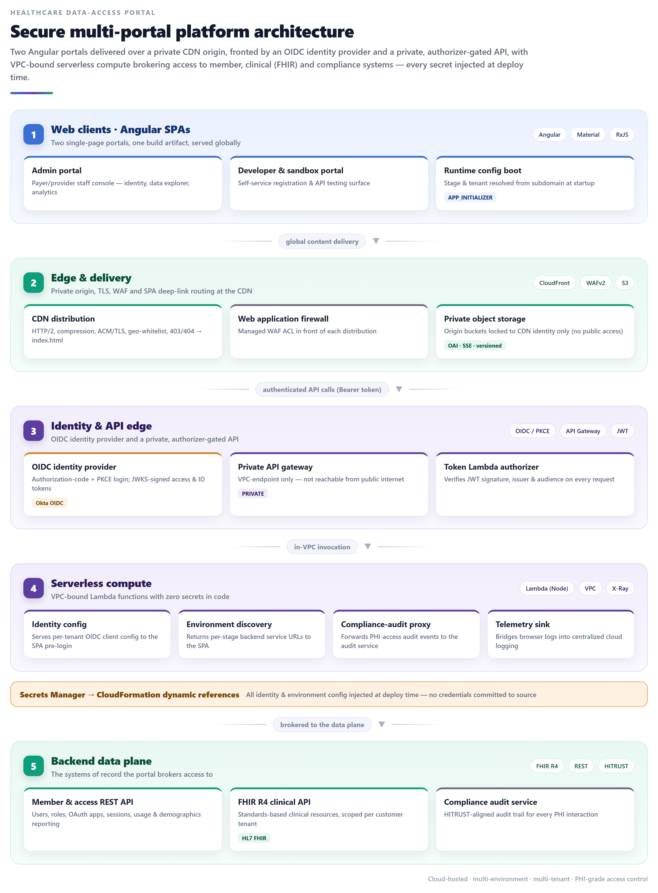
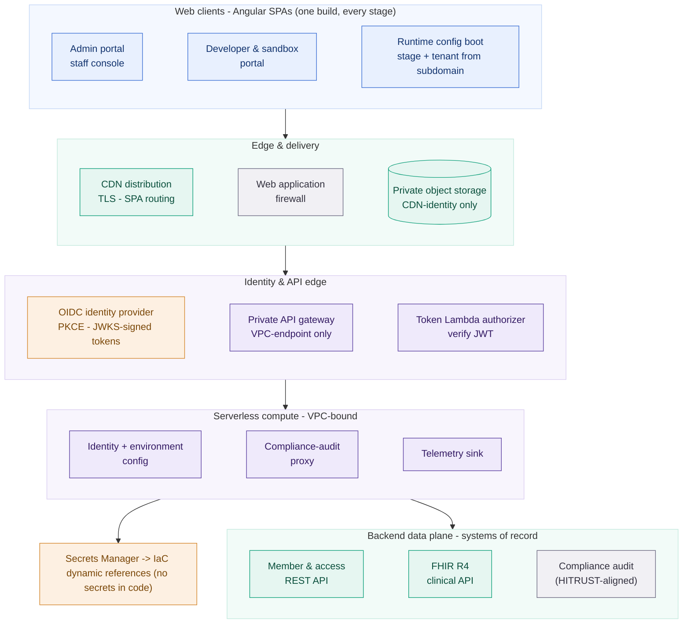
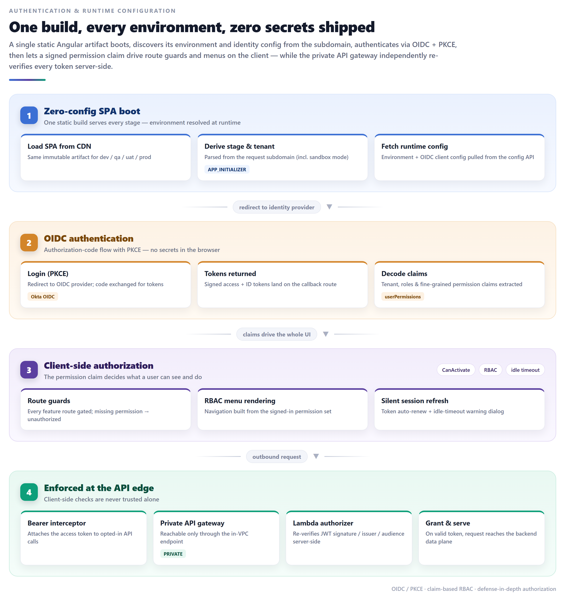
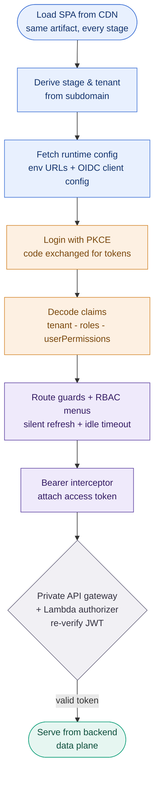
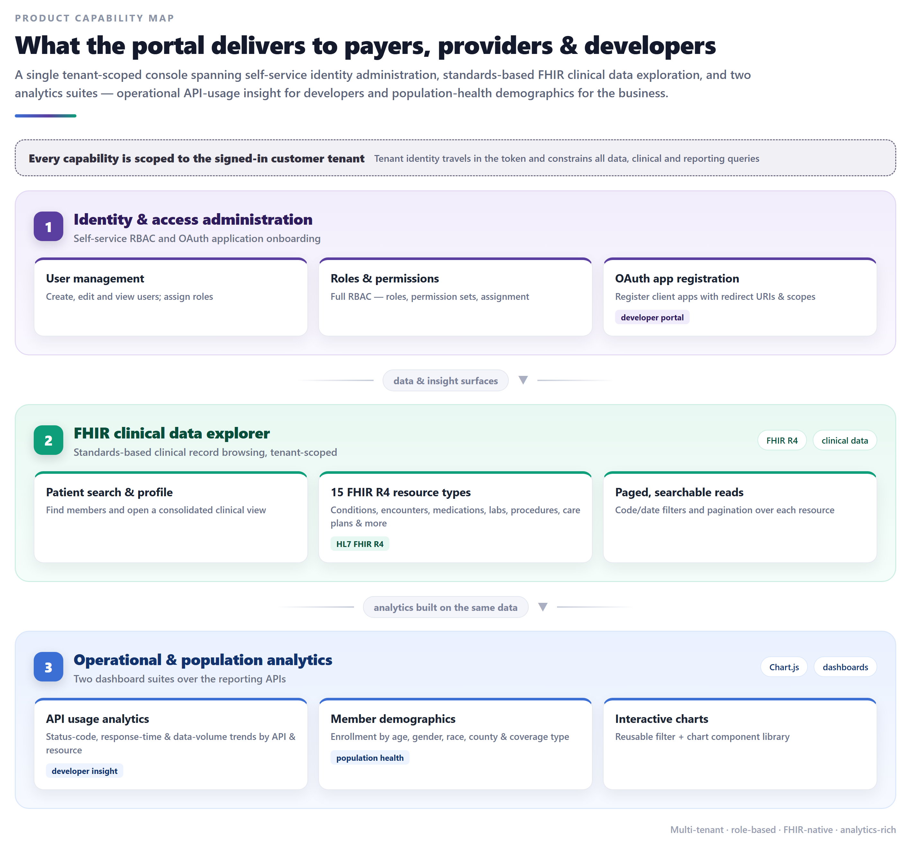
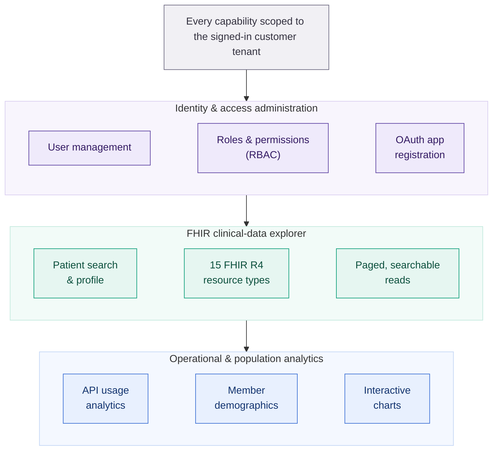
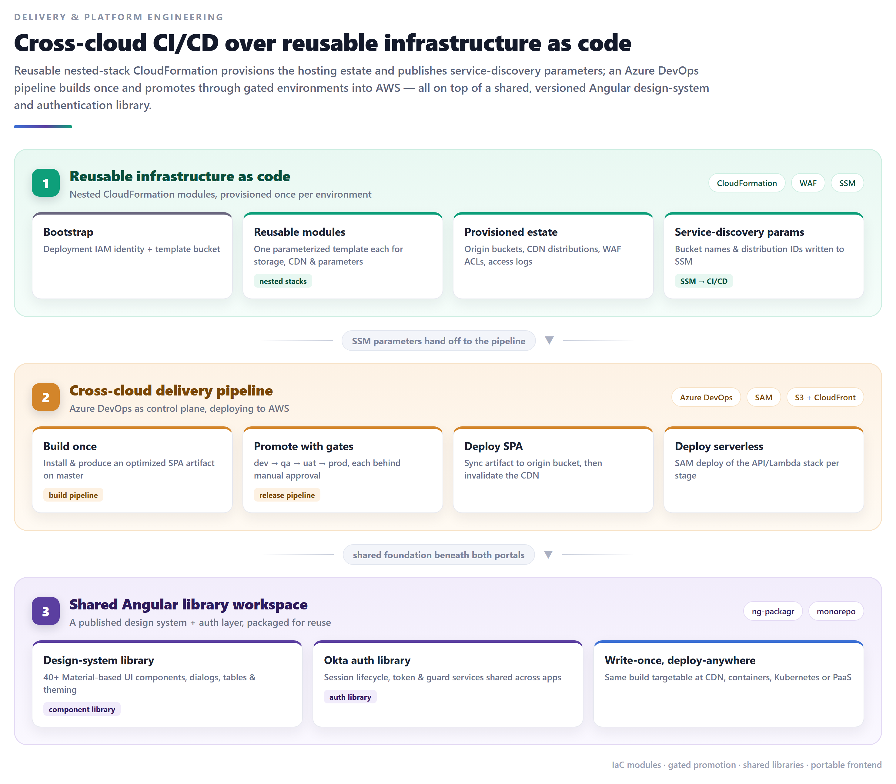
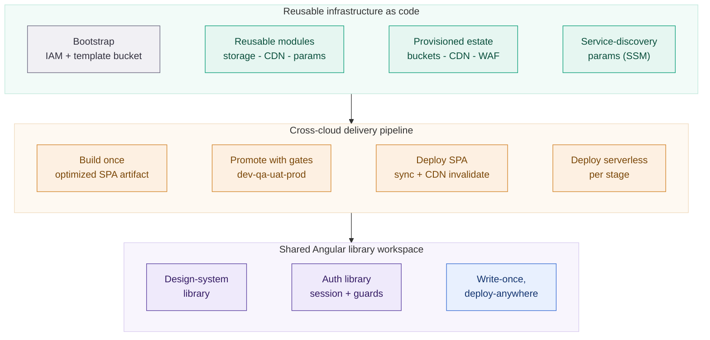

# Secure Healthcare Data-Access Portal Platform

## ⚠️ Proprietary Work & Copyright Notice

This case study represents proprietary methodologies and NDA-compliant frameworks.

**This project is NOT open-source.**

© 2026 Rohail K. Malhi. All rights reserved.

You are welcome to read and review these materials to understand my professional capabilities. However, you are **strictly prohibited** from copying, adapting, or utilizing these artifacts, structures, or content in any form. See [LICENSE](LICENSE).

---

**A secure, multi-tenant web portal platform that gives health-plan staff, providers, and third-party developers self-service access to member and clinical data. Two Angular single-page portals — an internal admin console and an external developer/sandbox portal — sit behind an OIDC identity provider and a *private*, authorizer-gated API, with a standards-based FHIR clinical-data explorer, role-based administration, OAuth application onboarding, and two analytics suites. The whole estate is provisioned as reusable infrastructure-as-code and shipped through a cross-cloud CI/CD pipeline, on a foundation of shared, versioned Angular design-system and authentication libraries.**

> **Confidentiality note.** This is a sanitized portfolio overview. The client identity, product names, brand assets, internal hostnames, cloud account identifiers, and proprietary source are withheld under NDA. Everything here describes engineering capabilities and architecture at a level safe for public sharing. Healthcare data standards referenced (FHIR, HITRUST, OIDC) are public industry standards and reveal no client data; internal identifiers, credentials, and any confidential content are intentionally omitted.

---

## Challenge

A healthcare-data organization needed to expose sensitive **member and clinical data** — protected health information (PHI) — to multiple audiences through the web, without compromising security, compliance, or trust:

- **Different audiences, one data estate.** Internal health-plan staff needed an administrative console; external partners and third-party developers needed a self-service portal to register applications and explore APIs against a sandbox. Building and operating these as separate, divergent codebases would have been slow and inconsistent.
- **PHI raises the bar on everything.** Every screen, API call, and audit event touches regulated healthcare data. Access had to be strongly authenticated, finely authorized per user and per tenant, and auditable end-to-end — with the API itself unreachable from the public internet.
- **Clinical data is only useful if it speaks a standard.** Consumers expected **HL7 FHIR** resources — patients, conditions, encounters, medications, labs, procedures, care plans — not a bespoke schema, so the portal needed a genuine FHIR data explorer rather than ad-hoc screens.
- **Many environments, many tenants, one artifact.** The same application had to run across development, QA, UAT, and production — split across separate cloud accounts — and serve multiple customer tenants, ideally from a single, immutable build rather than a per-environment rebuild.
- **Delivery had to be repeatable and governed.** Infrastructure and releases needed to be codified, promoted through approval gates, and reproducible — not hand-clicked in a console.

They needed a portal platform that was **secure and compliant by construction, standards-based, multi-tenant, and delivered as code** — one that could scale from one internal console to a public developer ecosystem without rework.

---

## Solution

A **two-portal platform over a shared front-end foundation**, engineered so that security, multi-tenancy, and repeatable delivery are structural rather than bolted on.

### Two portals, one build artifact
- **Admin portal** — an internal console for health-plan/provider staff: identity administration, the FHIR clinical-data explorer, and analytics.
- **Developer & sandbox portal** — an external surface for self-service registration and API testing against a sandbox tenant.
- **Runtime configuration, not build-time.** A single immutable Angular build serves *every* environment. On startup the app derives its **stage and tenant from the request subdomain**, then fetches its backend service URLs and OIDC client configuration from a config API — so one artifact promotes unchanged from dev to production, and sandbox vs. production is a runtime distinction.

### Security & identity by construction
- **OIDC with PKCE.** Authentication runs through an enterprise identity provider using the authorization-code + **PKCE** flow — no client secret in the browser. Access and ID tokens are JWKS-signed.
- **Claim-based RBAC.** A fine-grained **permission claim** in the signed token drives both route guards (every feature route is gated) and menu rendering — the UI only ever shows what a user is authorized to use. Silent token refresh and an idle-timeout warning manage the session.
- **Private, authorizer-gated API.** The backend API gateway is **private** — reachable only through an in-VPC endpoint, never the public internet. A **token Lambda authorizer** independently re-verifies every request's JWT (signature, issuer, audience) server-side, so client-side checks are never trusted alone.
- **No secrets in code.** All identity and environment configuration is injected at deploy time via secrets-manager → infrastructure dynamic references; nothing sensitive is committed to source.
- **Compliance-grade auditing.** PHI interactions are forwarded to a **HITRUST-aligned** compliance-audit trail.

### A standards-based FHIR clinical-data explorer
- **Real FHIR R4, tenant-scoped.** Patient search and a consolidated patient profile open onto **15 HL7 FHIR R4 resource types** — conditions, encounters, medications, allergies, diagnostic reports, procedures, immunizations, care plans, care teams, goals, devices, documents, and more — each with paging and code/date search, every query scoped to the signed-in customer tenant.

### Self-service administration & analytics
- **Identity & access administration.** Full RBAC — users, roles, and permission sets — plus **OAuth client-application registration** (redirect URIs, scopes) so partners can onboard their own integrations.
- **Two analytics suites.** An **API-usage** dashboard suite (status-code, response-time, and data-volume trends, sliced by API and by resource) gives developers operational insight; a **member-demographics** suite (enrollment by age, gender, race, county, and coverage type) gives the business population-health views — both built on a reusable filter-and-chart component pattern.

### Delivered as code, on a shared foundation
- **Reusable infrastructure-as-code.** A nested-stack pattern provisions the whole hosting estate — private origin buckets, CDN distributions, web-application-firewall ACLs, access logs — from a handful of parameterized, reusable templates, and publishes bucket names and distribution IDs to a parameter store for the pipeline to consume.
- **Cross-cloud CI/CD.** The delivery pipeline builds the SPA once and promotes it through **gated environments** (dev → QA → UAT → production, each behind manual approval) into the cloud — syncing to the origin bucket and invalidating the CDN — and separately deploys the serverless API stack per stage.
- **Shared Angular libraries.** A published **design-system library** (40+ UI components, dialogs, config-driven tables, theming) and a companion **authentication library** (session lifecycle, token, and guard services) are packaged and reused across applications — so both portals share one consistent, maintained foundation, and the frontend build is portable across CDN, container, Kubernetes, and PaaS targets.

---

## Architecture

Two Angular single-page portals are delivered from private object storage through a CDN (with a web-application firewall and SPA deep-link routing). Authenticated calls go to a **private** API gateway, gated by a token Lambda authorizer that verifies OIDC-issued JWTs; VPC-bound serverless functions serve configuration and proxy audit/telemetry, with all secrets injected at deploy time. Behind them sit the systems of record — a member/access REST API, a FHIR R4 clinical API, and a compliance-audit service.

Diagram source (Mermaid)

### Authentication & runtime configuration

One static build boots, resolves its environment and identity config from the subdomain, authenticates via OIDC + PKCE, then lets a signed permission claim drive the client UI — while the private API gateway re-verifies every token server-side.

Diagram source (Mermaid)

### Product capability map

A single tenant-scoped console spanning identity administration, FHIR clinical-data exploration, and two analytics suites.

Diagram source (Mermaid)

### Delivery & platform engineering

Reusable nested-stack infrastructure-as-code provisions the hosting estate and publishes service-discovery parameters; a cross-cloud pipeline builds once and promotes through gated environments — all on a shared, versioned Angular design-system and auth library.

Diagram source (Mermaid)

### Technology

| Layer | Stack |
|---|---|
| **Frontend** | Angular SPA · Angular Material + CDK + Flex-Layout · RxJS · lazy-loaded feature modules · Chart.js analytics · runtime (subdomain-driven) environment configuration |
| **Shared libraries** | Published design-system component library (40+ components, dialogs, config-driven tables, theming) + companion OIDC authentication library · `ng-packagr` · multi-project workspace |
| **Identity & authorization** | OIDC identity provider (Okta) · authorization-code + PKCE · JWKS-signed JWTs · claim-based RBAC (route guards + menu gating) · silent session refresh + idle-timeout |
| **API edge** | Private API Gateway (VPC-endpoint only) · token/request Lambda authorizer (JWT signature / issuer / audience verification) · CORS · Bearer-token HTTP interceptor |
| **Serverless compute** | AWS Lambda (Node.js) in-VPC · X-Ray tracing · identity-config, environment-discovery, compliance-audit-proxy & telemetry functions · AWS SAM |
| **Healthcare standards** | HL7 **FHIR R4** clinical resources (15 resource types) · **HITRUST**-aligned compliance auditing · PHI-scoped, per-tenant access |
| **Edge & hosting** | CloudFront (TLS/ACM, HTTP/2, geo-restriction, SPA 403/404 → index.html) · WAFv2 web ACLs · private, versioned, SSE-encrypted S3 origins via origin-access identity |
| **Config & secrets** | Secrets Manager → infrastructure dynamic references (zero secrets in code) · runtime config API for per-stage service discovery |
| **Infrastructure as code** | CloudFormation nested-stack pattern · reusable storage / CDN / parameter modules · per-environment parameter files · SSM Parameter Store service discovery |
| **CI/CD** | Cross-cloud pipeline (Azure DevOps → AWS) · build-once / promote-through-gated-environments (dev → QA → UAT → prod) · S3 sync + CloudFront invalidation · SAM deploy · multi-account (non-prod / prod) |
| **Quality** | Karma + Jasmine unit tests with coverage · Protractor e2e · TSLint + codelyzer · Prettier · Husky pre-commit lint |

---

## Engineering highlights

- **One immutable build, every environment and tenant.** The SPA resolves its stage, tenant, backend URLs, and identity config *at runtime* from the request subdomain and a config API — so a single artifact promotes unchanged from dev to production, and sandbox vs. production is a runtime distinction, not a rebuild.
- **Defense-in-depth authorization.** A signed permission claim drives client-side route guards and menu rendering, *and* a private, VPC-only API gateway backed by a token Lambda authorizer independently re-verifies every JWT server-side — the client is never the sole gatekeeper of PHI.
- **Private by default.** The API is unreachable from the public internet (VPC-endpoint only); the SPA origins are private buckets exposed solely through the CDN's origin-access identity; secrets are injected at deploy time, never committed.
- **Standards-based clinical data.** A genuine FHIR R4 explorer over 15 resource types — with paging and code/date search, tenant-scoped — rather than bespoke, one-off clinical screens.
- **A shared front-end foundation.** A versioned design-system library and a companion authentication library are packaged and consumed across applications, giving both portals one consistent, maintained base — and making the auth/session lifecycle reusable rather than re-implemented per app.
- **Compliance and observability built in.** HITRUST-aligned audit forwarding for PHI interactions, X-Ray tracing on serverless functions, and a browser-to-cloud telemetry bridge make behavior traceable.
- **Repeatable, governed delivery.** Reusable nested-stack IaC provisions the entire hosting estate and hands bucket/distribution identifiers to the pipeline through a parameter store; a cross-cloud pipeline builds once and promotes through manual-approval gates across separate cloud accounts.
- **Portable frontend.** The same optimized Angular build is targetable at a CDN, a container (Nginx), Kubernetes, or a PaaS static host — hosting is a deployment choice, not a code dependency.

---

## At a glance

A secure, multi-tenant **healthcare data-access portal platform** delivering two Angular single-page portals — an internal admin console and an external developer/sandbox portal — from one immutable build that resolves its environment, tenant, and identity configuration at runtime. Authentication runs on **OIDC + PKCE** with a signed permission claim driving **claim-based RBAC** across route guards and menus, while a **private, VPC-only API gateway** and a **token Lambda authorizer** re-verify every request server-side. The product spans self-service identity administration (users, roles, OAuth app registration), a standards-based **HL7 FHIR R4** clinical-data explorer across 15 resource types, and two analytics suites (API-usage and member demographics) — all tenant-scoped, PHI-aware, and **HITRUST-aligned** for audit. The entire estate is provisioned as reusable **nested-stack infrastructure-as-code** (private S3 origins, CloudFront, WAF) and shipped by a **cross-cloud CI/CD** pipeline that builds once and promotes through gated dev → QA → UAT → prod environments across multiple cloud accounts — on a foundation of shared, versioned Angular **design-system** and **authentication** libraries.

---

> *Notice: This case study has been modified to comply with confidentiality agreements. The resulting framework and artifacts remain the strict intellectual property of Rohail K. Malhi and may not be duplicated or repurposed.*
