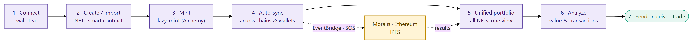
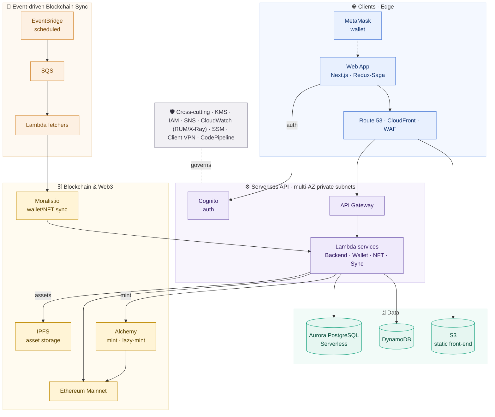

# Multi-Chain NFT Management Platform

## ⚠️ Proprietary Work & Copyright Notice

This case study represents proprietary methodologies and NDA-compliant frameworks.

**This project is NOT open-source.**

© 2026 Rohail K. Malhi. All rights reserved.

You are welcome to read and review these materials to understand my professional capabilities. However, you are **strictly prohibited** from copying, adapting, or utilizing these artifacts, structures, or content in any form. See [LICENSE](LICENSE).

---

**A single Web3 platform that lets NFT creators and traders mint, manage, and monetize their NFTs across multiple blockchains, wallets, and marketplaces — one account, one unified portfolio, one dashboard.**

> **Confidentiality note.** This is a sanitized portfolio overview. The client and product names, founder/partner identities, proprietary business rules, and internal source are withheld under NDA. Everything here describes capabilities and engineering approach at a level safe for public sharing. Screenshots are from a demo environment with the product logo redacted and illustrative (non-real) data. Outcome figures are representative and anonymized.

> 📄 **Client-facing case study (C-S-R):** [`multi-chain-nft-platform_case_study.pdf`](multi-chain-nft-platform_case_study.pdf) — a polished, shareable PDF with Challenge → Solution → Result, embedded screenshots (logos redacted).

---

## The problem

The NFT ecosystem is deeply fragmented. Value and activity are scattered across competing blockchain protocols (Ethereum, Polygon, Solana, Flow, Binance Smart Chain, Theta, …), each with its own wallets, marketplaces, and tooling. For a creator or trader, that means:

- **No single view.** Your NFTs live in different wallets on different chains, with no unified portfolio or valuation.
- **High technical burden.** Minting, lazy-minting, importing smart contracts, and moving assets each require chain-specific know-how.
- **Fragmented activity.** Buying, selling, sending, and tracking transactions means juggling multiple wallets, marketplaces, and block explorers.
- **No portfolio intelligence.** There's nowhere to see holdings, value, spend, earnings, and transaction history in one place.

The client's vision was a **"portfolio command-center for NFTs"** — one account to manage multiple wallets and smart contracts, and streamline every NFT activity across chains behind a single, simple experience.

---

## What it does

One account unifies a user's wallets and smart contracts, then streamlines the whole NFT lifecycle — from minting to portfolio analytics — with heavy blockchain work handled by an event-driven sync engine behind the scenes.

```mermaid
flowchart LR
    A["1 · Connect<br/>wallet(s)"] --> B["2 · Create / import<br/>NFT · smart contract"]
    B --> C["3 · Mint<br/>lazy-mint (Alchemy)"]
    C --> D["4 · Auto-sync<br/>across chains &amp; wallets"]
    D --> E["5 · Unified portfolio<br/>all NFTs, one view"]
    E --> F["6 · Analyze<br/>value &amp; transactions"]
    F --> G(["7 · Send · receive · trade"])
    D -. "EventBridge · SQS" .-> LK["Moralis · Ethereum<br/>IPFS"]
    LK -. results .-> E

    classDef step fill:#efeafb,stroke:#5b3fa0,color:#331a63;
    classDef out fill:#e6f6f1,stroke:#0e9f7a,color:#0a4f3c;
    classDef lk fill:#fff4d6,stroke:#c08a00,color:#5c4300;
    class A,B,C,D,E,F step;
    class G out;
    class LK lk;
```

Mermaid source (renders live on GitHub)

### One account, many wallets & chains
- Connect and manage **multiple wallets** (e.g. MetaMask) and **custom smart contracts** under a single account.
- **Multi-blockchain** support so holdings and activity across chains live in one place.
- A securely-managed **platform wallet** for in-app crypto operations.

### Mint & create
- **Design and mint NFTs**, including **lazy-minting** (mint-on-purchase, no upfront gas) via Alchemy APIs.
- Store NFT assets on **IPFS**; write and manage **custom smart contracts** (Solidity) with transfer / mint / lazy-mint capability.

### Unified portfolio & analytics
- See **all NFTs across every wallet and chain** in one view.
- **NFT Portfolio Analysis** — NFTs owned, portfolio value, total transactions, spend, earnings, and transactions-over-time — with wallet and smart-contract filters and date ranges.
- Responsive dashboard that works equally on desktop and mobile.

### Transact
- **Send and receive cryptocurrency** and NFTs.
- Streamlined buy/sell/trade activity across marketplaces.

### Always-fresh data
- An **event-driven sync engine** keeps the platform's view of wallets, NFTs, and transactions continuously reconciled with the blockchain (via Moralis and direct chain integration) on a configurable schedule.

---

## Architecture

A scalable, multi-tenant, **serverless** application on AWS, integrated with Web3 infrastructure. The interactive app stays fast because all blockchain reconciliation runs in an asynchronous, event-driven pipeline.

Mermaid source (renders live on GitHub)

**Serverless-first.** A Next.js single-page app is served from S3 via CloudFront; a serverless API (API Gateway + Lambda, Node.js/TypeScript) holds all business logic across Backend, Wallet, NFT, and Sync services. Scaling and cost follow real usage, with no servers to run.

**Event-driven blockchain sync.** Because blockchain reads are slow and rate-limited, reconciliation is decoupled: EventBridge fires on a configurable schedule → work is chunked onto SQS → Lambda fetchers query wallet/NFT/transaction data (via Moralis.io) and load results back into the platform's stores. The interactive dashboard reads pre-synced data and stays responsive.

**Web3 integration.** Minting and lazy-minting run through Alchemy against Ethereum; NFT assets are pinned to IPFS; custom Solidity smart contracts implement transfer/mint/lazy-mint; MetaMask connects user wallets.

**Secure by construction.** Serverless compute sits in private subnets across multiple availability zones, reachable only through API Gateway; public traffic enters solely via CloudFront with AWS WAF; the team reaches private resources through AWS Client VPN. Secrets and keys are managed with SSM Parameter Store and KMS; Cognito handles user authentication.

### Technology

| Layer | Stack |
|---|---|
| **Frontend** | Next.js · React · Redux-Saga (responsive desktop + mobile) |
| **Backend** | Node.js · TypeScript · Serverless Framework (AWS Lambda) · Sequelize |
| **Blockchain / Web3** | Ethereum · Solidity smart contracts · Alchemy (mint / lazy-mint) · Moralis.io · IPFS · MetaMask |
| **Data** | Amazon Aurora PostgreSQL Serverless · DynamoDB |
| **Eventing** | EventBridge · SQS · SNS |
| **Infra / platform** | API Gateway · CloudFront · WAF · Route 53 · Cognito · S3 · VPC · AWS Client VPN |
| **Security / ops** | KMS · IAM · SSM Parameter Store · CloudWatch (RUM · Application Insights · X-Ray) |
| **3rd-party** | Moralis.io · MetaMask · PubNub |
| **CI/CD** | AWS CodePipeline · CodeBuild |

---

## Engineering highlights

- **Unifying a fragmented ecosystem.** The hard problem is presenting one coherent portfolio across many wallets, chains, and marketplaces — solved with a normalized data model kept fresh by an event-driven sync engine rather than slow, on-demand chain reads.
- **Responsive, rich Web3 UX.** A Next.js dashboard makes complex on-chain actions (mint, lazy-mint, send/receive, import contracts) feel simple, on both desktop and mobile.
- **Async blockchain reconciliation.** EventBridge → SQS → Lambda fetchers reconcile wallet/NFT/transaction state with the chain on a configurable schedule, absorbing rate limits and keeping the app responsive.
- **Lazy-minting.** Mint-on-purchase via Alchemy removes upfront gas cost for creators — assets on IPFS, logic in custom Solidity contracts.
- **Security as a foundation.** Private-subnet serverless, public access only via CloudFront + WAF, team access via Client VPN, secrets in KMS/SSM, auth via Cognito.
- **Multi-tenant & serverless.** Built multi-tenant on a fully serverless AWS stack with CI/CD, so it scales per-usage and stays cost-efficient.

---

## Result

> *"[The platform] is built for NFT creators and traders to streamline all of your NFT activities — supporting all blockchains, all NFTs, in one single platform."*
> — Founder (identity withheld under NDA)

- **Launched to a top-3 "Product of the Day"** ranking on a leading product-launch platform.
- Delivered a **simplified, scalable, multi-tenant** MVP on AWS with a rich, intuitive UX — built end-to-end (product, architecture, tech-stack selection, and delivery) in roughly **eight months**.
- Made a fragmented, multi-chain NFT experience feel like **one account, one portfolio, one dashboard.**

---

## At a glance

A serverless, multi-tenant Web3 platform that unifies NFT activity across blockchains, wallets, and marketplaces — one account to mint (incl. lazy-mint), manage, analyze, and transact NFTs, backed by an event-driven blockchain-sync engine on AWS (Lambda, Aurora Serverless, DynamoDB, EventBridge/SQS) and Web3 infrastructure (Ethereum, Solidity, Alchemy, Moralis, IPFS) — launched to a top-3 product-of-the-day ranking.

---

> *Notice: This case study has been modified to comply with confidentiality agreements. The resulting framework and artifacts remain the strict intellectual property of Rohail K. Malhi and may not be duplicated or repurposed.*
