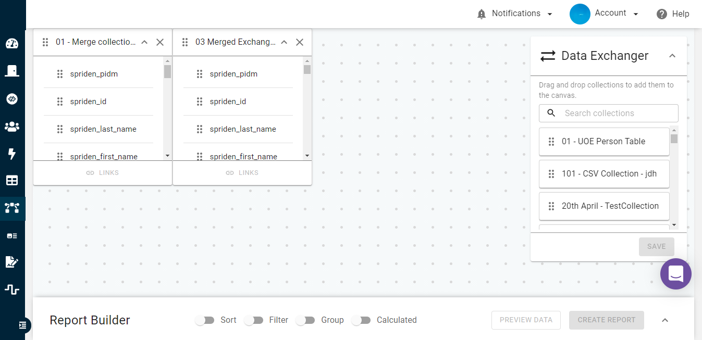
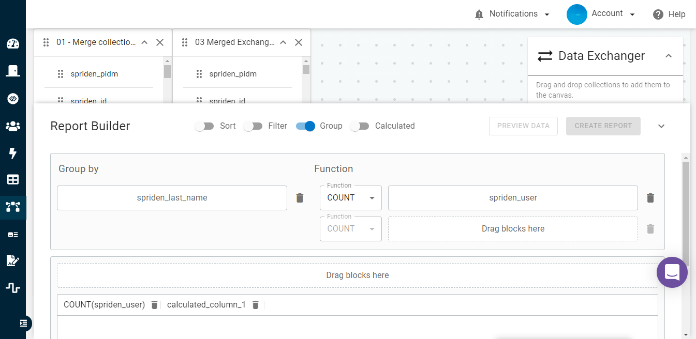
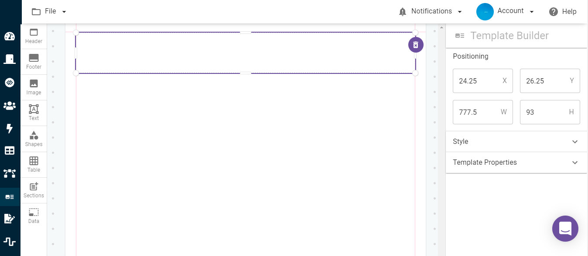
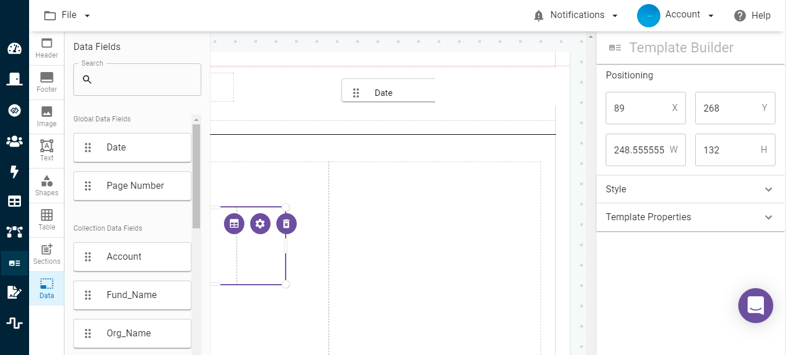
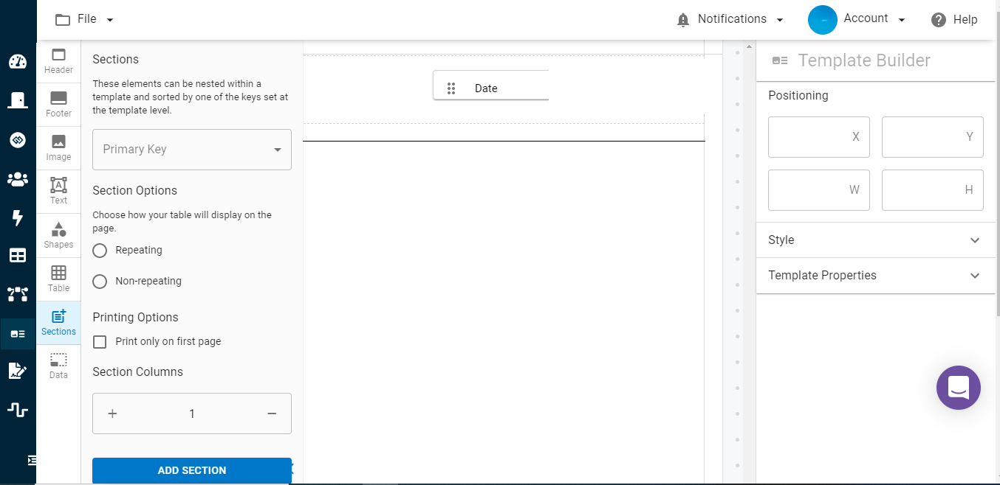
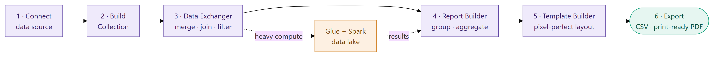
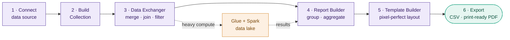
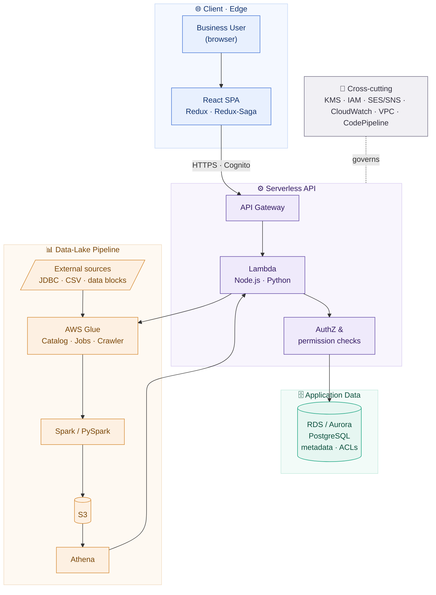

# Self-Service Reporting & Analytics Platform

## ⚠️ Proprietary Work & Copyright Notice

This case study represents proprietary methodologies and NDA-compliant frameworks.

**This project is NOT open-source.**

© 2026 Rohail K. Malhi. All rights reserved.

You are welcome to read and review these materials to understand my professional capabilities. However, you are **strictly prohibited** from copying, adapting, or utilizing these artifacts, structures, or content in any form. See [LICENSE](LICENSE).

---

**A cloud-native, self-service reporting product that lets non-technical business users pull data from any source, merge and shape it with drag-and-drop, and publish pixel-perfect reports — without writing a line of SQL.**

> **Confidentiality note.** This is a sanitized portfolio overview. The product name, client identity, proprietary business rules, and internal source are withheld under NDA. Everything here describes capabilities and engineering approach at a level safe for public sharing. Screenshots are from a demo/test environment with client and product logos redacted (see `images/REDACTION.md`).

> 📄 **Client-facing case study (C-S-R):** [`self_service_reporting_platform_case_study.pdf`](self_service_reporting_platform_case_study.pdf) — a polished, shareable PDF with Challenge → Solution → Result, embedded screenshots (logos redacted).

---

## The problem

Large organizations sit on data spread across operational databases, warehouses, and flat files. The people who actually need reports — administrators, analysts, department heads — usually *can't* write SQL, so every report request becomes a ticket to an overworked technical team. Turnaround is measured in days, and the backlog never clears.

The platform removes the technical team from the critical path. A business user connects to their data sources once, then builds and merges datasets and designs formatted reports entirely through a visual interface. What used to be a SQL-and-ETL task for engineers becomes a self-service action for the person who needs the answer.

---

## Screenshots

> Demo/test environment. See `images/REDACTION.md` for items to mask before external sharing.

| | |
|---|---|
| **Data Exchanger** — drag-and-drop dataset merge & join |  |
| **Report Builder** — group-by and aggregate functions, no SQL |  |
| **Template Builder** — visual, pixel-perfect report designer |  |
| **Data binding** — bind live data fields into the template |  |
| **Sections & layout** — repeating sections, columns, print rules |  |

---

## What it does

The whole product is one guided journey — from raw data to a finished, formatted report — with no SQL at any step. Heavy processing is offloaded to the data lake so the interface stays responsive.

Mermaid source (renders live on GitHub)

### Connect to any data source
- Save reusable connection profiles for **relational databases (JDBC)**, **CSV/flat files**, and **third-party reporting data blocks**.
- Connection details are stored once and shared across the organization, so end users pick a source instead of re-entering credentials.

### Collections — reusable datasets
- A **Collection** packages a dataset together with its metadata (field names, types, descriptions), so a curated dataset can be reused across many reports.
- Collections become the building blocks that non-technical users combine, rather than raw tables they'd have to understand.

### Data Exchanger — visual merge & shape
- **Drag-and-drop join** of two or more collections onto a canvas, with linking done visually instead of by hand-writing joins.
- Apply **filters, sorting, grouping, and aggregate functions** (COUNT, SUM, etc.) and derive **calculated columns** — all through a guided UI.
- Preview the resulting dataset before committing it to a report.

### Report & Template Builder
- Turn a shaped dataset into a **Report** — a saved, re-runnable output.
- A **pixel-perfect Template Builder** for formatted output: drag in headers, footers, images, text, tables, shapes, and repeating sections; position elements precisely; and **bind live data fields** (including global fields like date and page number) into the layout.
- Sections support repeating vs. non-repeating rendering, multi-column layouts, and print rules — the foundation for production documents such as transcripts and statements.
- Export to **CSV** and **print-ready PDF**.

### Governance, access & multi-tenancy
- **Enterprise SSO / directory integration** for authentication; users must be explicitly authorized for the resources they access.
- **Sites** provide multi-tenant isolation, letting an onboarded organization partition departments, campuses, or business units.
- **Groups** grant read-only, shared access to collections and reports across sets of users.
- Fine-grained **roles and permissions** on top of user accounts.

### Notifications
- Event- and action-driven notifications keep users informed of long-running jobs and report/collection changes.

---

## Architecture

A serverless, event-driven system on AWS: a React single-page app on the edge, a serverless API tier, and a Spark-based data-lake pipeline for heavy data processing.

Mermaid source (renders live on GitHub)

**Serverless-first.** The compute tier is AWS Lambda behind API Gateway, packaged and deployed with the Serverless Framework — no servers to manage, and cost/scaling that follow actual usage.

**Two data planes.** Application metadata (users, sites, collections, report definitions, permissions) lives in managed PostgreSQL (RDS / Aurora). The *actual* reporting data flows through a **data-lake pipeline** — AWS Glue for cataloging and ETL jobs, Spark/PySpark for distributed transformation on S3, and Athena as the query layer — so large dataset merges and aggregations run at scale instead of inside the request path.

**Edge-hosted SPA.** The React app is served from S3 via CloudFront; a managed identity provider handles authentication and directory federation.

**Secure by construction.** Encryption via KMS, least-privilege IAM roles per function, and VPC isolation for data-tier access. (A dedicated post-MVP effort benchmarked field-level encryption approaches for sensitive report data.)

### Technology

| Layer | Stack |
|---|---|
| **Frontend** | React · Redux · Redux-Saga · React Final Form · Reactstrap |
| **Backend** | Node.js · Sequelize · Python · Serverless Framework |
| **Data pipeline** | AWS Glue (Catalog · Jobs · Crawler) · Spark / PySpark · Athena · Boto3 |
| **Database** | Amazon RDS & Aurora (PostgreSQL) |
| **Infra / platform** | Lambda · API Gateway · S3 · CloudFront · Cognito · KMS · IAM · SES · SNS · SSM · VPC · Service Catalog |
| **Observability** | CloudWatch (metrics · logs · dashboards) |
| **CI/CD** | CodeBuild · CodePipeline · Git-based workflow |
| **QA** | Python · Pytest · Boto3 · Postman · Allure reporting |
| **Reporting output** | Server-side PDF generation (template-driven), CSV export |

---

## Engineering highlights

- **No-SQL analytics for non-engineers.** The hard part isn't drawing a UI — it's translating drag-and-drop joins, filters, group-bys, and calculated columns into correct, performant data operations against a Spark/Athena backend, and giving users a faithful preview before they commit.
- **Scale outside the request path.** Heavy dataset merges and aggregations are pushed into a Glue/Spark data-lake pipeline rather than executed synchronously, keeping the interactive app responsive while still handling large volumes.
- **Pixel-perfect, data-bound documents.** A visual template engine binds live data fields into positioned layouts with repeating sections and print rules — the basis for production documents (e.g. transcripts and statements) rendered server-side to PDF.
- **Multi-tenant governance.** Sites, groups, roles, and per-request authorization combine to isolate tenants and control exactly who can see which collections and reports.
- **Fully serverless delivery.** Serverless Framework + CodePipeline/CodeBuild give repeatable, infrastructure-as-code deployments with usage-based scaling and no server fleet to maintain.
- **Test discipline at delivery scale.** A Python/Pytest automation suite (with API testing via Postman and Allure reporting) backed a multi-sprint delivery that closed out hundreds of tracked defects across frontend, backend, and data-lake layers before release.

---

## At a glance

A serverless AWS platform that turns multi-source data into self-service reporting for non-technical users — visual dataset merging (Data Exchanger), no-SQL grouping and aggregation (Report Builder), and a pixel-perfect, data-bound Template Builder that outputs CSV and print-ready PDF — backed by a Glue/Spark/Athena data lake, multi-tenant governance, and end-to-end CI/CD.

---

> *Notice: This case study has been modified to comply with confidentiality agreements. The resulting framework and artifacts remain the strict intellectual property of Rohail K. Malhi and may not be duplicated or repurposed.*
