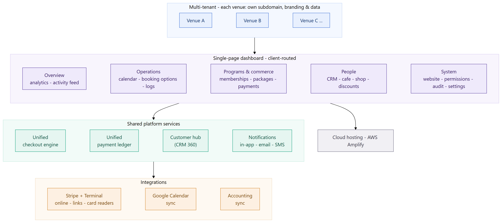
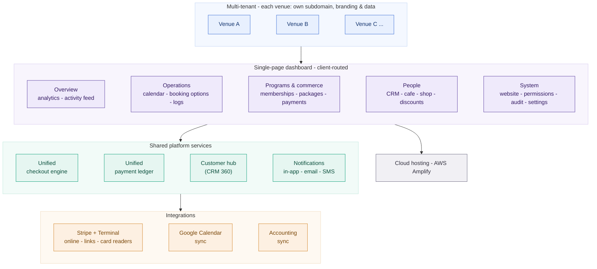
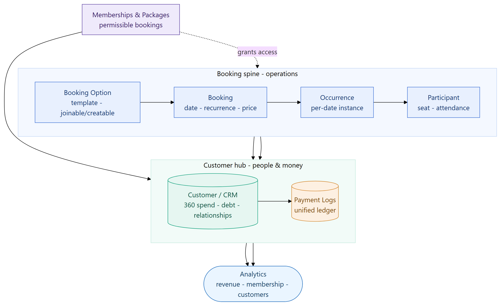
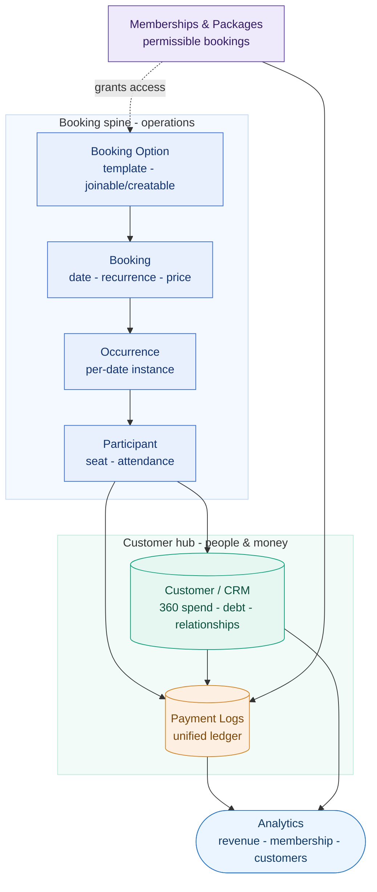
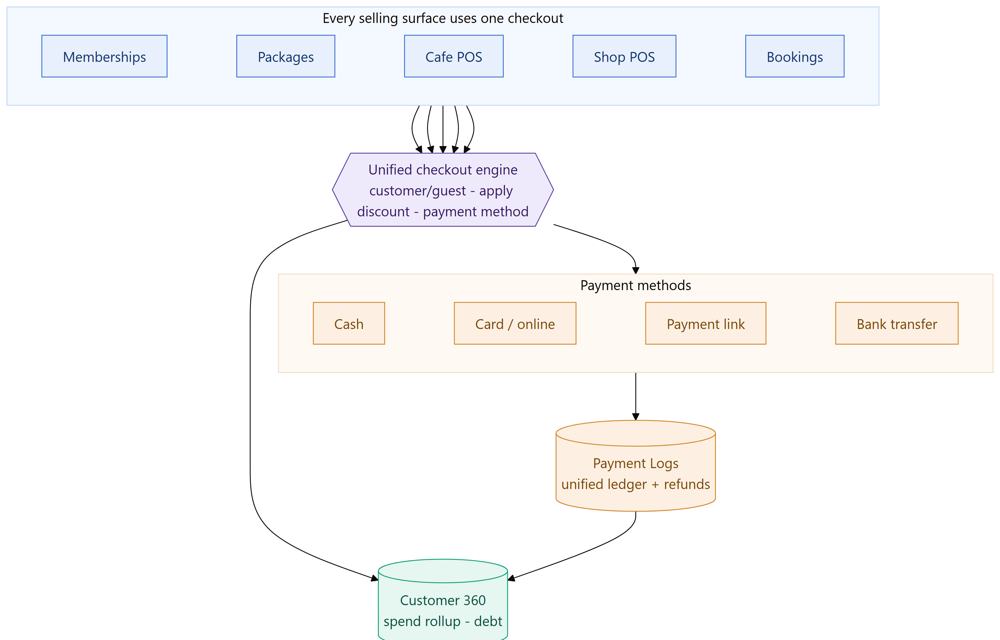
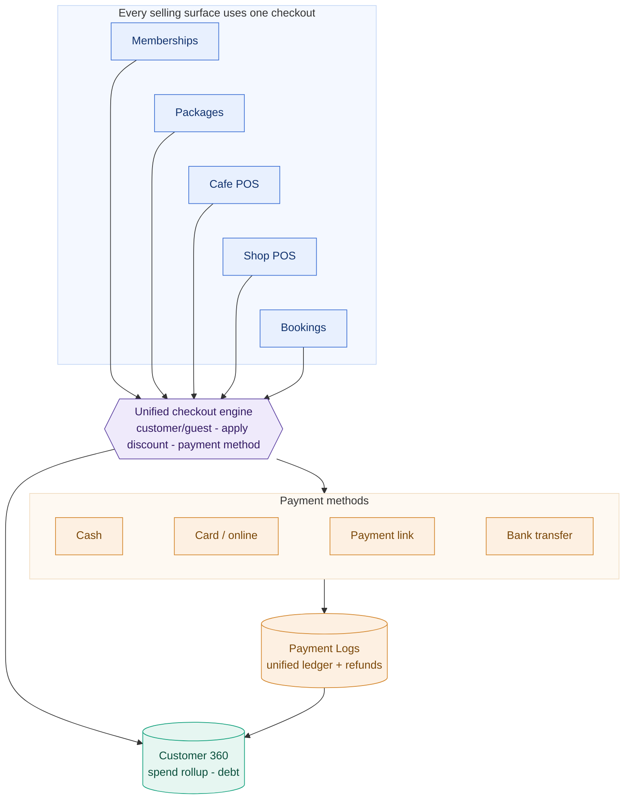

# Sports & Activity Venue Management Platform

## ⚠️ Proprietary Work & Copyright Notice

This case study represents proprietary methodologies and NDA-compliant frameworks.

**This project is NOT open-source.**

© 2026 Rohail K. Malhi. All rights reserved.

You are welcome to read and review these materials to understand my professional capabilities. However, you are **strictly prohibited** from copying, adapting, or utilizing these artifacts, structures, or content in any form. See [LICENSE](LICENSE).

---

**A multi-tenant vertical SaaS that runs an entire sports or activity venue from one product — scheduling and bookings, recurring memberships and prepaid packages, CRM, cafe and retail point-of-sale, equipment lending, promotions, a unified payment ledger, and a no-code public booking website — replacing the four-to-six disconnected tools a venue would otherwise stitch together.**

> **Confidentiality note.** This is a sanitized portfolio overview. The client identity, product name, brand assets, tenant names, and internal source are withheld under NDA. Everything here describes capabilities and engineering approach at a level safe for public sharing. Module counts reflect the delivered product; commercial figures are omitted.

---

## Challenge

A sports or activity venue — a five-a-side football centre, a martial-arts academy, a padel or tennis club, a multi-activity leisure centre — is really several businesses at once: a scheduler, a subscription biller, a shop, a cafe, an equipment desk, a CRM, and a marketing site. Off-the-shelf, each of those is a separate tool, and that fragmentation is the problem:

- **Four-to-six disconnected systems.** A booking calendar here, a card terminal there, a spreadsheet for members, another for equipment, a separate website — none of them talk to each other.
- **No single customer view.** Because a member's classes, membership, cafe tab, and shop purchases live in different tools, nobody can see what a customer is actually worth — or what they owe.
- **No single ledger.** Revenue arrives through bookings, memberships, packages, cafe, retail, and lending, but there's no one place where it all settles and rolls up.
- **Revenue leaks.** No-shows and late cancellations go untracked; cash debts are forgotten; there's no consistent refund policy.
- **Manual online presence.** Getting a bookable website usually means hiring a developer; most venues make do with phone-and-DM booking.
- **No safe delegation.** Owners can't hand reception or coaches limited access without giving away the keys, and there's no audit trail of who did what.

The venue needed **one system** where a booking, a customer, and a payment each flow through a single consistent spine — and where the owner can see and control the whole business.

---

## Solution

We built a **multi-tenant, vertical SaaS platform** for sports and activity venues. Each venue signs up as its own tenant — its own branded space, public subdomain, staff, settings, and data — and runs day-to-day operations from a single web dashboard. Seventeen modules span six areas (Overview, Operations, Programs, Commerce, People, System), but the product hangs together because it's built around **two structural ideas** and **one reused component**.

### Two organising ideas

- **The booking spine (operations).** A reusable **Booking Option** template becomes a scheduled **Booking**, which (if recurring) spawns dated **Occurrences**, each filled with **Participants**, each of whom generates a **Payment**. Booking Options come in two shapes: **Joinable** (group classes — fixed seats, priced per seat) and **Creatable** (resource rentals — priced by duration × rate, with split/custom payment).
- **The customer hub (people + money).** Everything links back to a **CRM customer**, and every charge lands in one **Payment Logs** ledger. Memberships, packages, bookings, cafe orders, shop sales, equipment loans, and debts all attach to a customer and produce a ledger row — so the venue gets a true 360° view of spend, debt, and relationships, and **Analytics** rolls it all up.

### One reused component — the unified checkout engine

The single most important piece of connective tissue is a **checkout engine that is identical everywhere money changes hands** — selling a membership, ringing up a coffee, taking a booking deposit, or selling merchandise. Every instance offers the same building blocks: **checkout as customer or guest** (searching the same CRM), **apply a discount** (validated against the same catalogue), pick a **payment method** (cash, card/online, payment link, or bank transfer), and review the same **order summary**. This is why the modules feel like one product rather than a bundle.

### What the platform does

- **Scheduling & capacity** — a weekly calendar with location and staff filters, recurring bookings, seats and duration, peak-hour pricing, multi-location, coach assignment, and per-participant attendance.
- **Recurring & prepaid revenue** — **Memberships** (recurring plans with proration and auto-renew) and **Packages** (prepaid session bundles with validity windows), each scoped to the Booking Options they unlock.
- **CRM** — custom fields, customer **relationships** (families/siblings, the basis for group discounts), notes, **debt** flags, and a per-customer activity/spend rollup, with bulk import.
- **Point of sale & lending** — cafe and merchandise POS with inventory and customer **tabs**, plus **equipment lending** (borrow → return tracking, with auto-attach of equipment to bookings).
- **Promotions** — a discount/promo-code engine scoped by product, payment method, audience, minimum people/price, usage limit, and expiry.
- **Unified payments** — one ledger across every revenue category, with Stripe online payments, **payment links**, in-person **card terminals**, cash and bank transfer, refunds, tax, and accounting-software sync.
- **Self-service** — a **no-code public booking microsite** per venue (branding, published offerings gated by an approvals workflow, online booking and payment, and enquiries that flow back into the CRM).
- **Governance** — per-module, per-staff **role-based access control**; a full **audit log** (who did what, from which IP/device); tiered **cancellation/refund** policy; and no-show **debt tracking** that writes back to the customer profile.
- **Insight** — an analytics dashboard with date-ranged KPIs (revenue, membership users, enquiries, customers), revenue-source and payment-method charts, and CSV export.

---

## Architecture

A multi-tenant single-page application: each venue is isolated by subdomain, branding, and data, and works out of one client-routed dashboard. The dashboard's modules all sit on top of a small set of **shared platform services** — the checkout engine, the unified ledger, the customer hub, and notifications — which in turn talk to external integrations.

Diagram source (Mermaid)

### The booking spine & customer hub

The operational spine produces transactions; the customer hub collects them per-customer and into one ledger; analytics rolls them up. Memberships and packages sit alongside, granting access to selected Booking Options.

Diagram source (Mermaid)

### One checkout, every revenue stream

Because the same checkout component backs memberships, packages, cafe, shop, and bookings, every sale references the same customer and discount catalogues and writes the same kind of payment record — so all revenue lands in one ledger and every purchase updates the customer's 360° view.

Diagram source (Mermaid)

### Technology

| Layer | Stack |
|---|---|
| **Frontend** | Single-page web application · client-side routing · responsive multi-tenant dashboard |
| **Multi-tenancy** | Per-venue subdomain, branding, staff, settings, and data isolation |
| **Payments** | Stripe (online/card) · Stripe Terminal (in-person card readers) · payment links · cash · bank transfer · tax handling |
| **Integrations** | Google Calendar (sync) · accounting-software sync · email (per-module alerts) · customer SMS |
| **Access & compliance** | Per-module, per-staff RBAC (`isAdmin` + granular permissions) · full audit log (user · IP · device) |
| **Public funnel** | No-code branded booking microsite per venue, with an approvals workflow |
| **Hosting** | AWS Amplify |

---

## Engineering highlights

- **One reused checkout, product-wide.** A single checkout engine backs every selling surface, so selling a membership, a coffee, or a booking deposit all run the same flow, reference the same customer and discount catalogues, and write the same payment record. It's the design decision that makes seventeen modules feel like one product.
- **A clean domain model.** The whole platform reduces to two ideas — a booking spine that produces transactions and a customer hub that collects them — which keeps every module connected rather than siloed.
- **Every revenue stream in one ledger.** Bookings, memberships, packages, cafe, retail, and lending all settle into one Payment Logs view and roll up into analytics — the single-source-of-truth the fragmented status quo lacks.
- **Multi-tenant by design.** Each venue is isolated by subdomain, branding, data, and staff, with per-module role-based access and a full audit trail for safe delegation.
- **Payments that meet customers anywhere.** Online, in-person terminal, remote payment link, cash, and bank transfer — plus tiered refunds and no-show **debt tracking** that writes back to the CRM to recover real losses.
- **Self-service revenue without a developer.** A no-code, branded public booking site per venue turns phone-and-DM booking into online booking, payment, and lead capture.

---

## At a glance

A multi-tenant vertical SaaS platform that runs a sports or activity venue end to end: seventeen modules — scheduling and bookings, recurring memberships and prepaid packages, CRM, cafe and retail POS, equipment lending, promotions, a unified payment ledger, and a no-code public booking site — unified by a single reused checkout engine and two clean organising ideas (a booking spine that produces transactions and a customer hub that collects them). It consolidates four-to-six disconnected tools into one governed system, puts every revenue stream in one ledger and every customer in one 360° view, and gives owners multi-tenant isolation, role-based delegation, tiered refund and debt controls, and self-service online booking.

---

> *Notice: This case study has been modified to comply with confidentiality agreements. The resulting framework and artifacts remain the strict intellectual property of Rohail K. Malhi and may not be duplicated or repurposed.*
